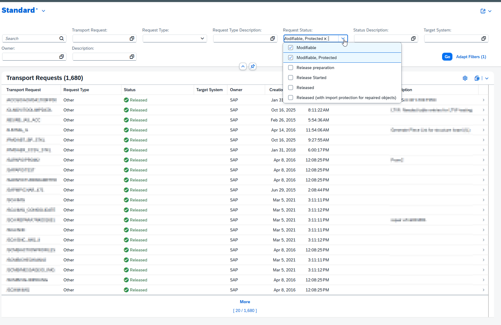
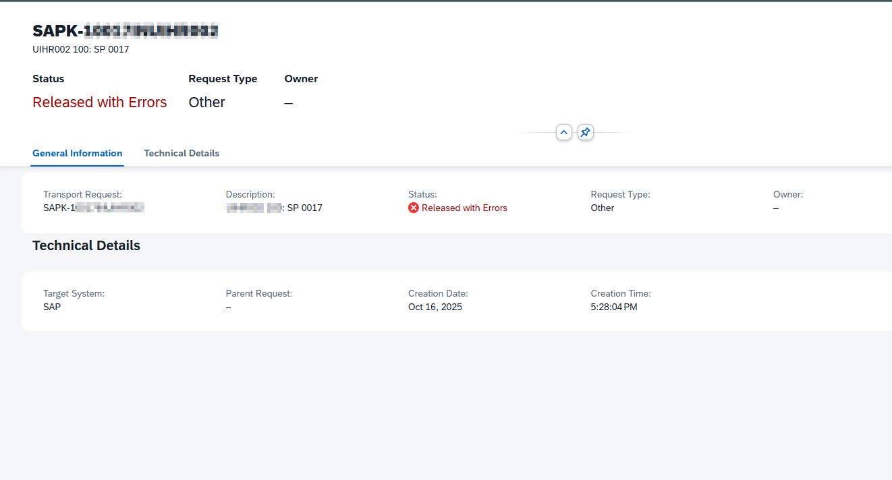
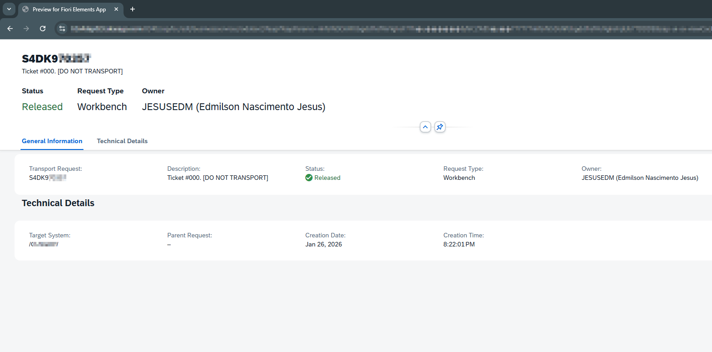

# 📋 abap-transport-toolkit


Enterprise-grade SAP transport request management built with **ABAP Cloud** and **RAP**.

[](https://www.sap.com/s4hana) [](https://www.sap.com/abap) [](LICENSE) [](https://tools.hana.ondemand.com/) [](https://github.com/edmilson-nascimento/abap-transport-toolkit) [](https://github.com/edmilson-nascimento/abap-transport-toolkit) [](https://github.com/edmilson-nascimento/abap-transport-toolkit/issues) [](https://github.com/edmilson-nascimento/abap-transport-toolkit/stargazers)

[](https://www.sap.com/abap) [](https://experience.sap.com/abap/rap) [](https://experience.sap.com/fiori) [](https://openui5.org)

[](https://github.com/SAP/abap-cleaner) [](https://github.com/larshp/abapGit)


## 📑 Index

- [Quick Start](#quick-start)
- [Overview](#overview)
- [Roadmap](#roadmap)
  - [FASE 1: Foundation (MVP)](#fase-1-foundation-mvp--complete)
  - [FASE 2.1: Visual Enhancements](#fase-21-visual-enhancements--complete)
  - [FASE 2.2: Value Helps & Filters](#fase-22-value-helps--filters--complete)
  - [FASE 2.3: Object Page Enhancements](#fase-23-object-page-enhancements--complete)
  - [FASE 2.4: Owner Name Resolution](#fase-24-owner-name-resolution--complete)
  - [FASE 3.1: Data Modeling](#fase-31-data-modeling-e071-)
  - [FASE 3.2: RAP Integration](#fase-32-rap-integration-composition-)
  - [FASE 3.3: UI Integration](#fase-33-ui-integration-object-page-)
  - [FASE 3.4: Visual Grouping](#fase-34-visual-grouping-ux-)
  - [FASE 3.5: Inverse Search](#fase-35-inverse-search-)
  - [FASE 4: Transport Tasks](#fase-4-transport-tasks-)
  - [FASE 5: ToC Creator](#fase-5-toc-creator-ztoc_creator-replacement-)
  - [FASE 6: Advanced Actions](#fase-6-advanced-actions-)
- [Version History](#version-history)
- [Current Objects](#current-objects)
- [Source Code](#complete-source-code)
- [Tech Stack](#tech-stack)
- [Requirements](#requirements)
- [Troubleshooting](#troubleshooting)
- [Learning Resources](#learning-resources)
- [Author](#author)
- [License](#license)


## 🚀 Quick Start

```bash
1. Open ADT (Eclipse) → Navigate to Service Binding: ZTR_UI_TRANSPORT_REQUEST_2
2. Click "Preview" → Select "TransportRequest" entity
3. 🎉 App launches with 35,000+ transport requests!
```

**Current Status:** FASE 2.4 Complete ✅  
**Features:** Color-coded status • User-friendly descriptions • Dropdown filters • Value Helps • Structured Object Page • Owner name resolution


## 📖 Overview

A study project focused on RAP (RESTful ABAP Programming) and ABAP Cloud.

The chosen use case is transport request management - a real-world scenario that exists in many companies, but is usually implemented with classic ABAP. The goal here is to rebuild these functionalities using modern patterns: CDS Views, Fiori Elements, and declarative architecture.

**Target audience:** ABAP developers, Basis teams, and anyone interested in seeing RAP applied in practice.

**Note:** This is a personal learning project. Manage your expectations accordingly.

---

## 🗺️ Roadmap

**Objectives:**
- ✅ Visualize transport requests with modern Fiori UI
- ✅ Replace legacy reports (ALV) with Fiori Elements
- ✅ Enable filtering, searching, drill-down
- ✅ Add colors and user-friendly descriptions
- ✅ Implement dropdown filters with Value Helps
- ✅ Structured Object Page with header and facets
- ✅ Resolve Owner User ID to full name
- ▫️ Automate Transport of Copies (ToC) creation
- ▫️ Track objects across transport requests (E071)
- ▫️ Implement batch operations and advanced actions

---

### **FASE 1: Foundation (MVP)** ✅ COMPLETE

**Goal:** Basic transport request viewer with Fiori Elements  
**Duration:** ~2 hours | **Lines of Code:** ~250 ABAP

```
Transport Request Viewer
├── ✅ CDS Interface View (ZTR_I_TRANSPORT_REQUEST)
├── ✅ CDS Projection View (ZTR_C_TRANSPORT_REQUEST)
├── ✅ Metadata Extension (UI Annotations)
├── ✅ Service Definition (OData contract)
└── ✅ Service Binding (Published & functional)

📊 Result: 35,000+ transport requests with filters & search
```

**Deliverables:**
- List Report with sortable columns
- 6 filter fields (Request, Type, Status, System, Owner, Description)
- Global search with fuzzy matching
- Object Page drill-down
- Zero custom JavaScript

---

### **FASE 2.1: Visual Enhancements** ✅ COMPLETE

**Goal:** Professional UI with colors and descriptions  
**Duration:** ~1 hour | **Lines Added:** ~100 ABAP

```
Visual Improvements
├── ✅ Status Colors (Criticality)
│   ├── 🟢 Green → Released (D)
│   ├── 🟡 Yellow → Modifiable (L)
│   └── 🔴 Red → Released with Errors (R)
│
├── ✅ Request Type Descriptions
│   ├── K → "Workbench"
│   ├── W → "Customizing"
│   └── S/T → "Transport of Copies"
│
└── ✅ Status Descriptions
    ├── D → "Released"
    ├── L → "Modifiable"
    └── R → "Released with Errors"

📊 Result: Color-coded UI with intuitive labels
```

**📸 Screenshot:**


*Professional UI with semantic colors and descriptions*

---

### **FASE 2.2: Value Helps & Filters** ✅ COMPLETE

**Goal:** Enhanced F4 helps and dropdown filters  
**Duration:** ~1.5 hours | **Lines Added:** ~150 ABAP

```
Value Helps Implementation
├── ✅ Status Value Help (Dropdown from DD07T)
├── ✅ Request Type Value Help (Dropdown from DD07T)
├── ✅ User/Owner Value Help (Dialog from E070)
├── ✅ Filter optimization (removed duplicates)
└── ✅ Service Definition updated with VH entities

📊 Result: Dropdown filters for Status and Type, Dialog for Owner
```

**📸 Screenshot:**



*Dropdown filters with Value Helps*

---

### **FASE 2.3: Object Page Enhancements** ✅ COMPLETE

**Goal:** Better detail view organization  
**Duration:** ~1 hour | **Lines Added:** ~50 ABAP

```
Object Page Improvements
├── ✅ Header Section
│   ├── Transport Request (title)
│   ├── Description (subtitle)
│   ├── Status (with color/criticality)
│   ├── Request Type
│   └── Owner
│
├── ✅ Facet: General Information
│   ├── Transport Request
│   ├── Description
│   ├── Status (with criticality)
│   ├── Request Type
│   └── Owner
│
└── ✅ Facet: Technical Details
    ├── Target System
    ├── Parent Request
    ├── Creation Date
    └── Creation Time

📊 Result: Professional detail layout with grouped information
```

**Implementation:** Metadata Extension with `@UI.facet`, `@UI.fieldGroup` and `@UI.dataPoint` annotations. 100% declarative — no changes to CDS Views, Service Definition or Service Binding.

**📸 Screenshot:**



*Structured Object Page with header data points and organized facets*

---

### **FASE 2.4: Owner Name Resolution** ✅ COMPLETE

**Goal:** Display owner full name instead of just User ID  
**Duration:** ~1.5 hours | **Lines Added:** ~30 ABAP

```
Owner Name Resolution
├── ✅ New CDS View Entity (ZTR_I_USER_NAME)
│   ├── Join USR21 + ADRP tables
│   └── Exposes FullName, FirstName, LastName
│
├── ✅ Interface View updated
│   ├── Association to ZTR_I_USER_NAME
│   └── OwnerName with format: USERID (Full Name)
│
├── ✅ Projection View updated
│   └── New field OwnerName exposed
│
└── ✅ Metadata Extension updated
    ├── Owner ID → List Report filter + table column
    └── OwnerName → Object Page header + General Info

📊 Result: Owner shows "JESUSEDM (Edmilson Nascimento Jesus)"
```

**Implementation:** New `ZTR_I_USER_NAME` CDS view entity replicating `V_USERNAME` logic using `USR21` + `ADRP` tables. Owner ID is kept for filtering while `OwnerName` provides human-readable display with fallback to User ID when name is unavailable.

**📸 Screenshot:**



*Owner name resolved from User ID to full name*

---

### **FASE 3.1: Data Modeling (E071)** ▫️

**Goal:** Create CDS view to read transport objects (`E071`) merging Request and Task data
**Duration:** ~2 hours

```
Data Model Expansion
├── ▫️ New Interface View (ZTR_I_TRANSPORT_OBJECT)
│   ├── Source: E071 (Transport Objects)
│   ├── Logic: Join E070 to identify Parent Request
│   └── Fields: PGMID, Object Type, Object Name, Task Owner
└── ▫️ Text Normalization
    └── Case statement for readable types (e.g., 'PROG' -> 'Program')

📊 Result: Backend ready to read objects from DB

```

---

### **FASE 3.2: RAP Integration (Composition)** ▫️

**Goal:** Establish Parent-Child relationship between Request and Objects
**Duration:** ~1 hour

```
Hierarchy Definition
├── ▫️ Root View (ZTR_I_TRANSPORT_REQUEST)
│   └── Add: Composition [0..*] of ZTR_I_TRANSPORT_OBJECT
│
├── ▫️ Child View (ZTR_I_TRANSPORT_OBJECT)
│   └── Add: Association to parent ZTR_I_TRANSPORT_REQUEST
│
└── ▫️ Service Definition
    └── Expose ZTR_I_TRANSPORT_OBJECT (for internal navigation)

📊 Result: OData service supports deep hierarchy

```

---

### **FASE 3.3: UI Integration (Object Page)** ▫️

**Goal:** Display the object list in a new Tab
**Duration:** ~1.5 hours

```
UI Implementation
├── ▫️ Projection View (ZTR_C_TRANSPORT_OBJECT)
│   └── Define UI fields (LineItem)
│
└── ▫️ Metadata Extension (ZTR_C_TRANSPORT_REQUEST)
    └── Add Facet: #LINEITEM_REFERENCE (Target: _Objects)

📊 Result: New "Objects" tab appears in the Object Page

```

---

### **FASE 3.4: Visual Grouping (UX)** ▫️

**Goal:** Organize objects visually by Task or Owner using Fiori Elements
**Duration:** ~1 hour

```
Visual Refinement
├── ▫️ Annotation: @UI.presentationVariant
│   └── groupBy: ['TaskOwner', 'TransportTask']
│
└── ▫️ Visual Result
    ├── Group 1: Task DEVK900001 (Owner: EDMILSON) - 5 Objects
    └── Group 2: Task DEVK900002 (Owner: JOHN) - 3 Objects

📊 Result: Organized, hierarchical view without custom JS

```

---

### **FASE 3.5: Inverse Search** ▫️

**Goal:** Find a Transport Request by searching for an object name
**Duration:** ~0.5 hours

```
Search Configuration
├── ▫️ Child Entity
│   └── Annotate ObjectName with @Search.defaultSearchElement
│
└── ▫️ List Report Behavior
    └── Searching "ZPROGRAM_001" returns the parent Request

📊 Result: "Where is this object?" question answered instantly

```
---

### **FASE 4: Transport Tasks** ▫️

**Goal:** Show child tasks hierarchy  
**Duration:** ~3 hours

```
Task Management
├── ▫️ CDS View (child records)
├── ▫️ Association (_Tasks: 1..N)
└── ▫️ Tasks Tab in Object Page

📊 Result: Full transport hierarchy
```

---

### **FASE 5: ToC Creator (ZTOC_CREATOR Replacement)** ▫️

**Goal:** Automate Transport of Copies creation  
**Duration:** ~12 hours

```
ToC Automation
├── ▫️ Multi-selection (checkboxes)
├── ▫️ RAP Actions (Behavior Definition)
│   ├── Create ToC
│   ├── Merge requests
│   └── Auto-release
├── ▫️ Business Logic
│   ├── TR_INSERT_REQUEST_WITH_TASKS
│   ├── TRINT_MERGE_COMMS
│   └── TRINT_RELEASE_REQUEST
└── ▫️ Validation & Feedback

📊 Result: One-click ToC creation in Fiori
```

> **Note:** `ZTOC_CREATOR` is a pseudo transaction name representing a custom Transport of Copies creation tool.

---

### **FASE 6: Advanced Actions** ▫️

**Goal:** Enterprise-grade operations  
**Duration:** ~8 hours

```
Action Library
├── ▫️ Release request (single-click)
├── ▫️ Add to existing ToC
├── ▫️ View in SE09/SE10 (deep link)
├── ▫️ Export to Excel
├── ▫️ Compare requests
├── ▫️ Check transport conflicts (ZCHECK_TRANSPORT_CONFLICTS)
└── ▫️ Batch operations

📊 Result: Complete transport management suite
```

> **Note:** `ZCHECK_TRANSPORT_CONFLICTS` is a pseudo transaction name representing a custom tool for validating transport conflicts before import.

---

## 🗓️ Version History

| Version | Date | Changes |
|---------|------|---------|
| **1.0.0** | 2025-01-26 | ✅ FASE 1 - Basic transport viewer |
| **1.1.0** | 2025-01-29 | ✅ FASE 2.1 - Visual enhancements |
| **1.2.0** | 2025-02-05 | ✅ FASE 2.2 - Value helps & dropdown filters |
| **1.3.0** | 2025-02-09 | ✅ FASE 2.3 - Object Page enhancements |
| **1.4.0** | 2025-02-09 | ✅ FASE 2.4 - Owner name resolution |
| **1.5.1** | TBD | ▫️ FASE 3.1 - Data Modeling (E071 view) |
| **1.5.2** | TBD | ▫️ FASE 3.2 - RAP Integration (Parent-Child) |
| **1.5.3** | TBD | ▫️ FASE 3.3 - UI Integration (Objects Tab) |
| **1.5.4** | TBD | ▫️ FASE 3.4 - Visual Grouping (UX) |
| **1.5.5** | TBD | ▫️ FASE 3.5 - Inverse Search configuration |
| **1.5.6** | TBD | ▫️ FASE 3.x - Refinements & Bugfixes |
| **2.0.0** | TBD | ▫️ FASE 5 - ToC Creator |

---

## 📦 Current Objects

```
Package: ZTRANSPORT_TOOLKIT
│
├── 📄 CDS Views (6)
│   ├── ZTR_I_TRANSPORT_REQUEST      (Interface View)
│   ├── ZTR_C_TRANSPORT_REQUEST      (Projection View)
│   ├── ZTR_I_USER_NAME              (User Name Resolution)
│   ├── ZTR_I_TRANSPORT_STATUS_VH    (Value Help - Status)
│   ├── ZTR_I_TRANSPORT_TYPE_VH      (Value Help - Type)
│   └── ZTR_I_USER_VH                (Value Help - User)
│
├── 🎨 Metadata Extensions (1)
│   └── ZTR_C_TRANSPORT_REQUEST
│
├── 🌐 Service Definitions (1)
│   └── ZTR_UI_TRANSPORT_REQUEST_O4
│
└── 🔗 Service Bindings (2)
    ├── ZTR_UI_TRANSPORT_REQUEST     (OData V4 - if available)
    └── ZTR_UI_TRANSPORT_REQUEST_2   (OData V2 - recommended)
```

---

## 📝 Complete Source Code

<details>
<summary><b>📄 ZTR_I_TRANSPORT_REQUEST (Interface View)</b></summary>

```abap
@AbapCatalog.viewEnhancementCategory: [#NONE]
@AccessControl.authorizationCheck: #NOT_REQUIRED
@EndUserText.label: 'Transport Request - Interface View'
@Metadata.ignorePropagatedAnnotations: true

define root view entity ZTR_I_TRANSPORT_REQUEST
  as select from e070

  association [0..1] to e07t                      as _Text     on  $projection.TransportRequest = _Text.trkorr
                                                               and _Text.langu                  = $session.system_language

  // Value Help Associations
  association [0..1] to ZTR_I_TRANSPORT_STATUS_VH as _StatusVH on  $projection.RequestStatus = _StatusVH.Status
  association [0..1] to ZTR_I_TRANSPORT_TYPE_VH   as _TypeVH   on  $projection.RequestType = _TypeVH.RequestType
  association [0..1] to ZTR_I_USER_VH             as _UserVH   on  $projection.Owner = _UserVH.UserID

  // User Name Resolution
  association [0..1] to ZTR_I_USER_NAME           as _UserName on  $projection.Owner = _UserName.UserID

{
      @EndUserText.label: 'Transport Request'
  key trkorr        as TransportRequest,

      @EndUserText.label: 'Request Type'
      trfunction    as RequestType,

      @EndUserText.label: 'Request Status'
      trstatus      as RequestStatus,

      @EndUserText.label: 'Target System'
      tarsystem     as TargetSystem,

      @EndUserText.label: 'Owner'
      as4user       as Owner,

      @EndUserText.label: 'Owner Name'
      case when _UserName.FullName is not initial
        then concat_with_space(
               as4user,
               concat( '(', concat( _UserName.FullName, ')' ) ),
               1 )
        else as4user
      end as OwnerName,

      @EndUserText.label: 'Creation Date'
      as4date       as CreationDate,

      @EndUserText.label: 'Creation Time'
      as4time       as CreationTime,

      @EndUserText.label: 'Parent Request'
      strkorr       as ParentRequest,

      @EndUserText.label: 'Description'
      _Text.as4text as Description,

      // Criticality for Status Colors
      @EndUserText.label: 'Status Criticality'
      case trstatus
        when 'D' then 3  // Released = Green (Positive)
        when 'L' then 2  // Modifiable = Yellow (Critical)
        when 'R' then 1  // Released with errors = Red (Negative)
        else 0           // Others = Neutral
      end           as StatusCriticality,

      // Request Type Description
      @EndUserText.label: 'Request Type Description'
      case trfunction
        when 'K' then 'Workbench'
        when 'W' then 'Customizing'
        when 'S' then 'Transport of Copies'
        when 'T' then 'Transport of Copies'
        when 'E' then 'Customizing (Extended)'
        when 'Q' then 'Customizing (Request)'
        when 'R' then 'Workbench (Repair)'
        else 'Other'
      end           as RequestTypeText,

      // Status Description
      @EndUserText.label: 'Status Description'
      case trstatus
        when 'D' then 'Released'
        when 'L' then 'Modifiable'
        when 'R' then 'Released with Errors'
        when 'N' then 'Not Released'
        when 'O' then 'Released (Import Finished)'
        else 'Unknown'
      end           as StatusText,

      /* Associations */
      _Text,
      _StatusVH,
      _TypeVH,
      _UserVH,
      _UserName
}
where
  strkorr = '' // Only ORDERs (no TASKs)
```

</details>

<details>
<summary><b>📄 ZTR_C_TRANSPORT_REQUEST (Projection View)</b></summary>

```abap
@EndUserText.label: 'Transport Request - Projection View'
@AccessControl.authorizationCheck: #NOT_REQUIRED
@Metadata.allowExtensions: true
@Search.searchable: true

define root view entity ZTR_C_TRANSPORT_REQUEST
  provider contract transactional_query
  as projection on ZTR_I_TRANSPORT_REQUEST
{
      @Search.defaultSearchElement: true
      @Search.fuzzinessThreshold: 0.8
  key TransportRequest,

      @Search.defaultSearchElement: true
      @Consumption.valueHelpDefinition: [{
        entity: { name: 'ZTR_I_TRANSPORT_TYPE_VH', element: 'RequestType' }
      }]
      RequestType,

      @Search.defaultSearchElement: true
      @Consumption.valueHelpDefinition: [{
        entity: { name: 'ZTR_I_TRANSPORT_STATUS_VH', element: 'Status' }
      }]
      RequestStatus,

      @Search.defaultSearchElement: true
      TargetSystem,

      @Search.defaultSearchElement: true
      @Consumption.valueHelpDefinition: [{
        entity: { name: 'ZTR_I_USER_VH', element: 'UserID' }
      }]
      Owner,

      @Search.defaultSearchElement: true
      OwnerName,

      CreationDate,
      CreationTime,
      ParentRequest,

      @Search.defaultSearchElement: true
      Description,

      StatusCriticality,

      @Search.defaultSearchElement: true
      RequestTypeText,

      @Search.defaultSearchElement: true
      StatusText
}
```

</details>

<details>
<summary><b>🎨 ZTR_C_TRANSPORT_REQUEST (Metadata Extension)</b></summary>

```abap
@Metadata.layer: #CORE
@UI: {
  headerInfo: {
    typeName: 'Transport Request',
    typeNamePlural: 'Transport Requests',
    title: { type: #STANDARD, value: 'TransportRequest' },
    description: { value: 'Description' }
  }
}

annotate view ZTR_C_TRANSPORT_REQUEST with
{

  // FACETS - Object Page structure
  @UI: {
    facet: [
      // Header Data Points
      {
        id: 'HeaderStatus',
        purpose: #HEADER,
        type: #DATAPOINT_REFERENCE,
        targetQualifier: 'StatusData',
        position: 10
      },
      {
        id: 'HeaderType',
        purpose: #HEADER,
        type: #DATAPOINT_REFERENCE,
        targetQualifier: 'TypeData',
        position: 20
      },
      {
        id: 'HeaderOwner',
        purpose: #HEADER,
        type: #DATAPOINT_REFERENCE,
        targetQualifier: 'OwnerData',
        position: 30
      },
      // Body Facets
      {
        id: 'GeneralInfo',
        type: #IDENTIFICATION_REFERENCE,
        label: 'General Information',
        position: 10
      },
      {
        id: 'TechnicalDetails',
        type: #FIELDGROUP_REFERENCE,
        label: 'Technical Details',
        targetQualifier: 'TechnicalDetails',
        position: 20
      }
    ],
    // List Report & General Information
    lineItem: [{ position: 10, importance: #HIGH }],
    selectionField: [{ position: 10 }],
    identification: [{ position: 10 }]
  }
  TransportRequest;

  // Filter with dropdown (hidden in table)
  @UI.selectionField: [{ position: 15 }]
  RequestType;

  // Table + General Info (pos 40) + Header DataPoint
  @UI: {
    lineItem: [{ position: 20, importance: #HIGH, label: 'Request Type' }],
    identification: [{ position: 40, label: 'Request Type' }],
    dataPoint: { qualifier: 'TypeData', title: 'Request Type' }
  }
  RequestTypeText;

  // Filter with dropdown (hidden in table)
  @UI.selectionField: [{ position: 25 }]
  RequestStatus;

  // Table + General Info (pos 30) + Header DataPoint with criticality
  @UI: {
    lineItem: [{ position: 30, importance: #HIGH, label: 'Status', criticality: 'StatusCriticality' }],
    identification: [{ position: 30, label: 'Status', criticality: 'StatusCriticality' }],
    dataPoint: { qualifier: 'StatusData', title: 'Status', criticality: 'StatusCriticality' }
  }
  StatusText;

  // Table + Filter + Technical Details (pos 10)
  @UI: {
    lineItem: [{ position: 40, importance: #MEDIUM }],
    selectionField: [{ position: 40 }],
    fieldGroup: [{ qualifier: 'TechnicalDetails', position: 10, label: 'Target System' }]
  }
  TargetSystem;

  // Table + Filter (Owner ID for filtering)
  @UI: {
    lineItem: [{ position: 50, importance: #MEDIUM }],
    selectionField: [{ position: 50 }]
  }
  Owner;

  // General Info (pos 50) + Header DataPoint (Owner full name)
  @UI: {
    identification: [{ position: 50, label: 'Owner' }],
    dataPoint: { qualifier: 'OwnerData', title: 'Owner' }
  }
  OwnerName;

  // Table + Technical Details (pos 30)
  @UI: {
    lineItem: [{ position: 60, importance: #LOW }],
    fieldGroup: [{ qualifier: 'TechnicalDetails', position: 30, label: 'Creation Date' }]
  }
  CreationDate;

  // Table + Technical Details (pos 40)
  @UI: {
    lineItem: [{ position: 70, importance: #LOW }],
    fieldGroup: [{ qualifier: 'TechnicalDetails', position: 40, label: 'Creation Time' }]
  }
  CreationTime;

  // Table + Technical Details (pos 20)
  @UI: {
    lineItem: [{ position: 80, importance: #LOW }],
    fieldGroup: [{ qualifier: 'TechnicalDetails', position: 20, label: 'Parent Request' }]
  }
  ParentRequest;

  // Table + Filter + General Info (pos 20)
  @UI: {
    lineItem: [{ position: 90, importance: #HIGH }],
    selectionField: [{ position: 60 }],
    identification: [{ position: 20 }]
  }
  Description;

  @UI.hidden: true
  StatusCriticality;

}
```

</details>

<details>
<summary><b>📄 ZTR_I_USER_NAME (User Name Resolution)</b></summary>

```abap
@AbapCatalog.viewEnhancementCategory: [#NONE]
@AccessControl.authorizationCheck: #NOT_REQUIRED
@EndUserText.label: 'User Name - View Entity'
@Metadata.ignorePropagatedAnnotations: true
@ObjectModel.usageType: {
  serviceQuality: #A,
  sizeCategory: #L,
  dataClass: #MASTER
}

define view entity ZTR_I_USER_NAME
  as select from usr21
    inner join adrp on  usr21.persnumber = adrp.persnumber
                    and adrp.date_from   = '00010101'
{
      @ObjectModel.text.element: ['FullName']
  key usr21.bname        as UserID,

      @Semantics.text: true
      adrp.name_text     as FullName,

      adrp.name_first    as FirstName,
      adrp.name_last     as LastName
}
```

</details>

<details>
<summary><b>📄 ZTR_I_TRANSPORT_STATUS_VH (Value Help - Status)</b></summary>

```abap
@AbapCatalog.viewEnhancementCategory: [#NONE]
@AccessControl.authorizationCheck: #NOT_REQUIRED
@EndUserText.label: 'Transport Status - Value Help'
@Metadata.ignorePropagatedAnnotations: true
@ObjectModel.usageType: {
  serviceQuality: #A,
  sizeCategory: #S,
  dataClass: #CUSTOMIZING
}
@ObjectModel.resultSet.sizeCategory: #XS  // Renders as dropdown!

define view entity ZTR_I_TRANSPORT_STATUS_VH
  as select from dd07t
{
      @ObjectModel.text.element: ['StatusText']
  key domvalue_l as Status,

      @Semantics.text: true
      ddtext     as StatusText
}
where domname    = 'TRSTATUS'
  and ddlanguage = $session.system_language
```

</details>

<details>
<summary><b>📄 ZTR_I_TRANSPORT_TYPE_VH (Value Help - Type)</b></summary>

```abap
@AbapCatalog.viewEnhancementCategory: [#NONE]
@AccessControl.authorizationCheck: #NOT_REQUIRED
@EndUserText.label: 'Transport Type - Value Help'
@Metadata.ignorePropagatedAnnotations: true
@ObjectModel.usageType: {
  serviceQuality: #A,
  sizeCategory: #S,
  dataClass: #CUSTOMIZING
}
@ObjectModel.resultSet.sizeCategory: #XS

define view entity ZTR_I_TRANSPORT_TYPE_VH
  as select from dd07t
{
      @ObjectModel.text.element: ['TypeText']
      @UI.hidden: true
  key domvalue_l as RequestType,

      @Semantics.text: true
      ddtext     as TypeText
}
where
      domname    = 'TRFUNCTION'
  and ddlanguage = $session.system_language
```

</details>

<details>
<summary><b>📄 ZTR_I_USER_VH (Value Help - User)</b></summary>

```abap
@AbapCatalog.viewEnhancementCategory: [#NONE]
@AccessControl.authorizationCheck: #NOT_REQUIRED
@EndUserText.label: 'User - Value Help'
@Metadata.ignorePropagatedAnnotations: true
@ObjectModel.usageType: {
  serviceQuality: #A,
  sizeCategory: #M,
  dataClass: #MASTER
}

define view entity ZTR_I_USER_VH
  as select distinct from e070
{
      @ObjectModel.text.element: ['UserName']
  key as4user as UserID,

      @Semantics.text: true
      as4user as UserName
}
where
  as4user <> ''
```

</details>

<details>
<summary><b>🌐 ZTR_UI_TRANSPORT_REQUEST_O4 (Service Definition)</b></summary>

```abap
@EndUserText.label: 'Transport Request Service Definition'
define service ZTR_UI_TRANSPORT_REQUEST_O4 {
  expose ZTR_C_TRANSPORT_REQUEST   as TransportRequest;
  expose ZTR_I_TRANSPORT_STATUS_VH as TransportStatus;
  expose ZTR_I_TRANSPORT_TYPE_VH   as TransportType;
  expose ZTR_I_USER_VH             as Users;
}
```

</details>

<details>
<summary><b>🔗 Service Bindings</b></summary>

### ZTR_UI_TRANSPORT_REQUEST_2 (OData V2 - Recommended)

**Configuration:**
- **Binding Type:** OData V2 - UI
- **Service Definition:** ZTR_UI_TRANSPORT_REQUEST_O4
- **Service URL:** `/sap/opu/odata/sap/ZTR_UI_TRANSPORT_REQUEST_2`

**Exposed Entities:**
- TransportRequest
- TransportStatus
- TransportType
- Users

**Steps to Create:**
1. Right-click Service Definition → New Service Binding
2. Name: `ZTR_UI_TRANSPORT_REQUEST_2`
3. Type: **OData V2 - UI**
4. Activate → **Publish** (mandatory!)
5. Click Preview → Select entity → Test

> **Note:** OData V2 is recommended for better compatibility. Use V4 only if your system has it fully configured.

</details>

---

## 🛠️ Tech Stack

| Component | Technology | Version |
|-----------|------------|---------|
| Platform | SAP S/4HANA On-Premise | 2023 |
| Language | ABAP Cloud compliant | - |
| Framework | RAP (RESTful ABAP) | - |
| Data Layer | CDS Views | - |
| Protocol | OData V2 | - |
| UI | SAP Fiori Elements | - |
| Pattern | List Report + Object Page | - |
| Tool | Eclipse ADT | 4.35.0 |

---

## 📋 Requirements

**System:**
- SAP S/4HANA 2023+
- ABAP Platform 2023
- Development client (e.g., 100)

**Tools:**
- Eclipse IDE with ADT 4.35.0+
- Fiori Launchpad access

**Authorizations:**
- `S_DEVELOP` (CDS creation)
- `S_CTS_ADMI` (transport access)
- Service publication rights

---

## 🔧 Troubleshooting

### Service won't publish

**Error:** `Publishing in Customizing Client not allowed`

**Solution:**
1. Ensure development client (not 000)
2. Use OData V2 - UI (not V4)
3. Check service publication authorization

---

### Data not loading

**Solution:**
1. Verify Service Binding is **Published** (not just activated)
2. Check CDS views activated without errors
3. Confirm E070 table has data
4. Clear browser cache (Ctrl+F5)

---

### Dropdown not showing

**Solution:**
1. Verify Value Help views are activated
2. Check `@ObjectModel.resultSet.sizeCategory: #XS` annotation
3. Ensure Value Help is exposed in Service Definition
4. Republish Service Binding

---

### Owner name showing only User ID

**Solution:**
1. Verify `ZTR_I_USER_NAME` is activated
2. Check `USR21` and `ADRP` tables have data for the user
3. Confirm `adrp.date_from = '00010101'` returns a record
4. If `name_text` is empty in ADRP, the fallback shows the User ID

---

## 🎓 Learning Resources

### RAP & CDS
- [SAP RAP Documentation](https://help.sap.com/docs/abap-cloud/abap-rap)
- [CDS Development Guide](https://help.sap.com/docs/SAP_NETWEAVER_750/cc0c305d2fab47bd808adcad3ca7ee9d/4ed1f2e06e391014adc9fffe4e204223.html)

### Fiori Elements
- [Fiori Elements Overview](https://sapui5.hana.ondemand.com/sdk/#/topic/03265b0408e2432c9571d6b3feb6b1fd)
- [List Report Pattern](https://experience.sap.com/fiori-design-web/list-report-floorplan-sap-fiori-element/)

### ABAP Cloud
- [ABAP Cloud Guide](https://help.sap.com/docs/btp/sap-business-technology-platform/abap-cloud)

---

## 👨‍💻 Author

**Edmilson Nascimento**  
Senior SAP ABAP Developer & Development Stream Leader

**Expertise:**
- ABAP Cloud & RAP Development
- S/4HANA Migration & Modernization
- CDS Views & Fiori Elements

**Connect:**
- GitHub: [@edmilson-nascimento](https://github.com/edmilson-nascimento)
- LinkedIn: [Edmilson Nascimento](https://www.linkedin.com/in/edmilson-nascimento)

---

## 📄 License

MIT License - Free to use in your projects

<details>
<summary><b>View full license</b></summary>

```
MIT License

Copyright (c) 2025 Edmilson Nascimento

Permission is hereby granted, free of charge, to any person obtaining a copy
of this software and associated documentation files (the "Software"), to deal
in the Software without restriction, including without limitation the rights
to use, copy, modify, merge, publish, distribute, sublicense, and/or sell
copies of the Software, and to permit persons to whom the Software is
furnished to do so, subject to the following conditions:

The above copyright notice and this permission notice shall be included in all
copies or substantial portions of the Software.

THE SOFTWARE IS PROVIDED "AS IS", WITHOUT WARRANTY OF ANY KIND, EXPRESS OR
IMPLIED, INCLUDING BUT NOT LIMITED TO THE WARRANTIES OF MERCHANTABILITY,
FITNESS FOR A PARTICULAR PURPOSE AND NONINFRINGEMENT. IN NO EVENT SHALL THE
AUTHORS OR COPYRIGHT HOLDERS BE LIABLE FOR ANY CLAIM, DAMAGES OR OTHER
LIABILITY, WHETHER IN AN ACTION OF CONTRACT, TORT OR OTHERWISE, ARISING FROM,
OUT OF OR IN CONNECTION WITH THE SOFTWARE OR THE USE OR OTHER DEALINGS IN THE
SOFTWARE.
```

</details>

---

**Last Updated:** February 2025  
**Current Phase:** FASE 2.4 Complete ✅  
**Next Milestone:** Transport Objects (E071) & Transport Tasks

---

**Made with ❤️ using ABAP Cloud & RAP**
