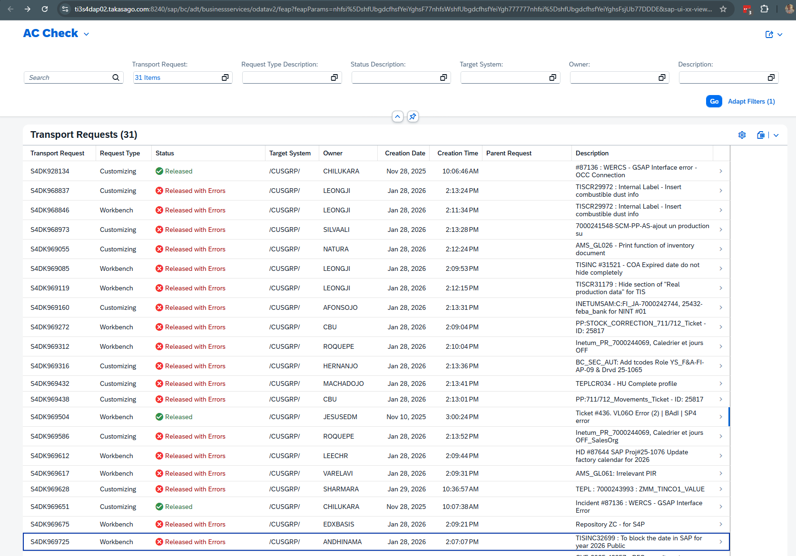
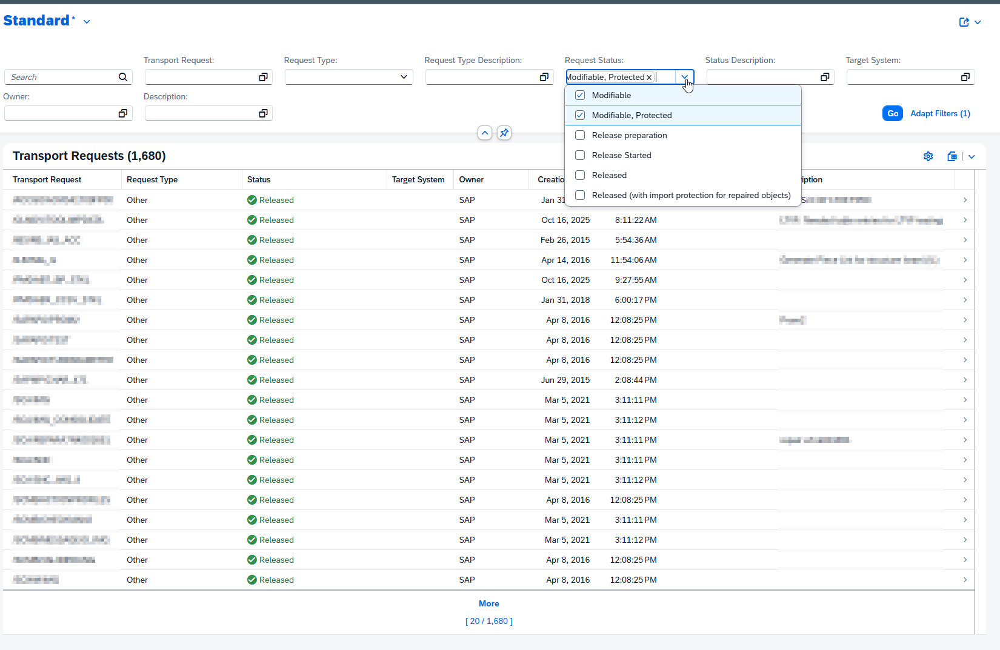
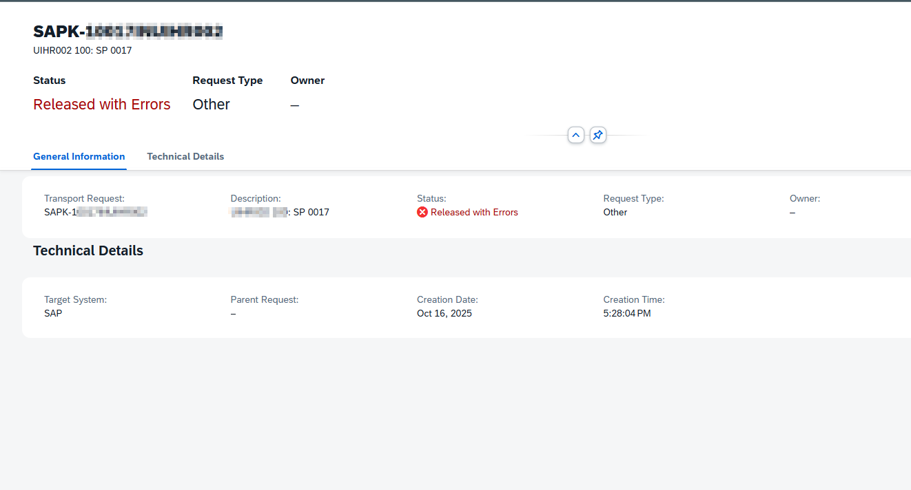
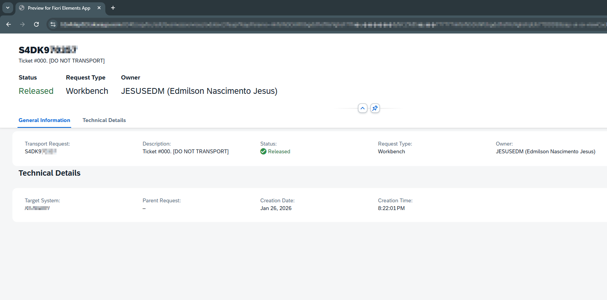

# 📋 abap-transport-toolkit


Enterprise-grade SAP transport request management built with **ABAP Cloud** and **RAP**.

[](https://www.sap.com/s4hana) [](https://www.sap.com/abap) [](LICENSE) [](https://tools.hana.ondemand.com/) [](https://github.com/edmilson-nascimento/abap-transport-toolkit) [](https://github.com/edmilson-nascimento/abap-transport-toolkit) [](https://github.com/edmilson-nascimento/abap-transport-toolkit/issues) [](https://github.com/edmilson-nascimento/abap-transport-toolkit/stargazers)

[](https://www.sap.com/abap) [](https://experience.sap.com/abap/rap) [](https://experience.sap.com/fiori) [](https://openui5.org)

[](https://github.com/SAP/abap-cleaner) [](https://github.com/larshp/abapGit)


## 📑 Index

- [Quick Start](#quick-start)
- [Overview](#overview)
- [Roadmap](#roadmap)
  - [FASE 1: Foundation (MVP)](#fase-1-foundation-mvp--complete)
  - [FASE 2.1: Visual Enhancements](#fase-21-visual-enhancements--complete)
  - [FASE 2.2: Value Helps & Filters](#fase-22-value-helps--filters--complete)
  - [FASE 2.3: Object Page Enhancements](#fase-23-object-page-enhancements--complete)
  - [FASE 2.4: Owner Name Resolution](#fase-24-owner-name-resolution--complete)
  - [FASE 3.1: Data Modeling](#fase-31-data-modeling-e071--complete)
  - [FASE 3.2: RAP Integration](#fase-32-rap-integration-composition--complete)
  - [FASE 3.3: UI Integration](#fase-33-ui-integration-object-page--complete)
  - [FASE 3.4: Visual Grouping](#fase-34-visual-grouping-ux--complete)
  - [FASE 3.5: Inverse Search](#fase-35-inverse-search--complete)
  - [FASE 4: Transport Tasks](#fase-4-transport-tasks--complete)
  - [FASE 4.1: CTS Project field](#fase-41-cts-project-field--implemented-pending-ui-test)
  - [FASE 5: ToC Creator](#fase-5-toc-creator-ztoc_creator-replacement-)
  - [FASE 6: Advanced Actions](#fase-6-advanced-actions-)
- [Version History](#version-history)
- [Deployment](#-deployment)
- [Current Objects](#current-objects)
- [Source Code](#complete-source-code)
- [Tech Stack](#tech-stack)
- [Requirements](#requirements)
- [Troubleshooting](#troubleshooting)
- [Learning Resources](#learning-resources)
- [Author](#author)
- [License](#license)


## 🚀 Quick Start

```bash
# Deployed app (BSP ZTR_TOOLKIT, Fiori Elements V4)
https://<sap-host>:<port>/sap/bc/ui5_ui5/sap/ztr_toolkit/index.html

# Or, in ADT (Eclipse): Service Binding ZTR_UI_TRANSPORT_REQ_O4 → Preview → "TransportRequest"
```

**Current Status:** v1.7 — FASE 4.1 implemented (CTS Project field, pending UI test) · OData V4 · app deployed to the development system  
**Features:** Color-coded status (matching real SE10/domain semantics) • Texts read from SAP domains, not hand-typed • Dropdown filters • Value Helps • Structured Object Page • Owner name resolution • Transport Objects (E071) • Request → Tasks → Objects navigation • Inverse search (find a Request by object name) • CTS Project column/filter • Deployed Fiori Elements V4 app


## 📖 Overview

A study project focused on RAP (RESTful ABAP Programming) and ABAP Cloud.

The chosen use case is transport request management - a real-world scenario that exists in many companies, but is usually implemented with classic ABAP. The goal here is to rebuild these functionalities using modern patterns: CDS Views, Fiori Elements, and declarative architecture.

**Target audience:** ABAP developers, Basis teams, and anyone interested in seeing RAP applied in practice.

**Note:** This is a personal learning project. Manage your expectations accordingly.

---

## 🗺️ Roadmap

**Objectives:**
- ✅ Visualize transport requests with modern Fiori UI
- ✅ Replace legacy reports (ALV) with Fiori Elements
- ✅ Enable filtering, searching, drill-down
- ✅ Add colors and user-friendly descriptions
- ✅ Implement dropdown filters with Value Helps
- ✅ Structured Object Page with header and facets
- ✅ Resolve Owner User ID to full name
- ✅ Track objects across transport requests and tasks (E071)
- ✅ Deploy as a standalone Fiori Elements app
- ▫️ Pre-transport checks + automate Transport of Copies (ToC) creation (FASE 5)
- ▫️ Implement batch operations and advanced actions

---

### **FASE 1: Foundation (MVP)** ✅ COMPLETE

**Goal:** Basic transport request viewer with Fiori Elements  
**Duration:** ~2 hours | **Lines of Code:** ~250 ABAP

```
Transport Request Viewer
├── ✅ CDS Interface View (ZTR_I_TRANSPORT_REQUEST)
├── ✅ CDS Projection View (ZTR_C_TRANSPORT_REQUEST)
├── ✅ Metadata Extension (UI Annotations)
├── ✅ Service Definition (OData contract)
└── ✅ Service Binding (Published & functional)

📊 Result: 35,000+ transport requests with filters & search
```

**Deliverables:**
- List Report with sortable columns
- 6 filter fields (Request, Type, Status, System, Owner, Description)
- Global search with fuzzy matching
- Object Page drill-down
- Zero custom JavaScript

---

### **FASE 2.1: Visual Enhancements** ✅ COMPLETE

**Goal:** Professional UI with colors and descriptions  
**Duration:** ~1 hour | **Lines Added:** ~100 ABAP

```
Visual Improvements
├── ✅ Status Colors (Criticality)
│   ├── 🟢 Green → Released (D)
│   ├── 🟡 Yellow → Modifiable (L)
│   └── 🔴 Red → Released with Errors (R)
│
├── ✅ Request Type Descriptions
│   ├── K → "Workbench"
│   ├── W → "Customizing"
│   └── S/T → "Transport of Copies"
│
└── ✅ Status Descriptions
    ├── D → "Released"
    ├── L → "Modifiable"
    └── R → "Released with Errors"

📊 Result: Color-coded UI with intuitive labels
```

**📸 Screenshot:**



*Professional UI with semantic colors and descriptions*

---

### **FASE 2.2: Value Helps & Filters** ✅ COMPLETE

**Goal:** Enhanced F4 helps and dropdown filters  
**Duration:** ~1.5 hours | **Lines Added:** ~150 ABAP

```
Value Helps Implementation
├── ✅ Status Value Help (Dropdown from DD07T)
├── ✅ Request Type Value Help (Dropdown from DD07T)
├── ✅ User/Owner Value Help (Dialog from E070)
├── ✅ Filter optimization (removed duplicates)
└── ✅ Service Definition updated with VH entities

📊 Result: Dropdown filters for Status and Type, Dialog for Owner
```

**📸 Screenshot:**



*Dropdown filters with Value Helps*

---

### **FASE 2.3: Object Page Enhancements** ✅ COMPLETE

**Goal:** Better detail view organization  
**Duration:** ~1 hour | **Lines Added:** ~50 ABAP

```
Object Page Improvements
├── ✅ Header Section
│   ├── Transport Request (title)
│   ├── Description (subtitle)
│   ├── Status (with color/criticality)
│   ├── Request Type
│   └── Owner
│
├── ✅ Facet: General Information
│   ├── Transport Request
│   ├── Description
│   ├── Status (with criticality)
│   ├── Request Type
│   └── Owner
│
└── ✅ Facet: Technical Details
    ├── Target System
    ├── Parent Request
    ├── Creation Date
    └── Creation Time

📊 Result: Professional detail layout with grouped information
```

**Implementation:** Metadata Extension with `@UI.facet`, `@UI.fieldGroup` and `@UI.dataPoint` annotations. 100% declarative — no changes to CDS Views, Service Definition or Service Binding.

**📸 Screenshot:**



*Structured Object Page with header data points and organized facets*

---

### **FASE 2.4: Owner Name Resolution** ✅ COMPLETE

**Goal:** Display owner full name instead of just User ID  
**Duration:** ~1.5 hours | **Lines Added:** ~30 ABAP

```
Owner Name Resolution
├── ✅ New CDS View Entity (ZTR_I_USER_NAME)
│   ├── Join USR21 + ADRP tables
│   └── Exposes FullName, FirstName, LastName
│
├── ✅ Interface View updated
│   ├── Association to ZTR_I_USER_NAME
│   └── OwnerName with format: USERID (Full Name)
│
├── ✅ Projection View updated
│   └── New field OwnerName exposed
│
└── ✅ Metadata Extension updated
    ├── Owner ID → List Report filter + table column
    └── OwnerName → Object Page header + General Info

📊 Result: Owner shows "DEVUSER (John Developer)"
```

**Implementation:** New `ZTR_I_USER_NAME` CDS view entity replicating `V_USERNAME` logic using `USR21` + `ADRP` tables. Owner ID is kept for filtering while `OwnerName` provides human-readable display with fallback to User ID when name is unavailable.

**📸 Screenshot:**



*Owner name resolved from User ID to full name*

---

### **FASE 3.1: Data Modeling (E071)** ✅ COMPLETE

**Goal:** Create CDS view to read transport objects (`E071`) merging Request and Task data
**Duration:** ~1 hour

```
Data Model Expansion
├── ✅ New Interface View (ZTR_I_TRANSPORT_OBJECT)
│   ├── Source: E071 (Transport Objects)
│   ├── Logic: Association to E070 resolves the parent Request
│   │          (rolls a Task's objects up to its owning Request)
│   └── Fields: ProgramId, ObjectType, ObjectName, ObjectFunction,
│               LockFlag, TaskOwner, TransportRequest
└── ✅ Text Normalization
    └── Case statement for readable types (e.g., 'PROG' -> 'Program')

📊 Result: Backend ready to read objects from DB
```

<details>
<summary><b>📄 ZTR_I_TRANSPORT_OBJECT (Interface View)</b></summary>

```abap
@AbapCatalog.viewEnhancementCategory: [#NONE]
@AccessControl.authorizationCheck: #NOT_REQUIRED
@EndUserText.label: 'Transport Object - Interface View'
@Metadata.ignorePropagatedAnnotations: true

define view entity ZTR_I_TRANSPORT_OBJECT
  as select from e071

  association [0..1] to e070               as _Task    on  $projection.EntryRequest = _Task.trkorr

  association to parent ZTR_I_TRANSPORT_REQUEST as _Request on  $projection.EntryRequest = _Request.TransportRequest

{
      @EndUserText.label: 'Entry Request/Task'
  key trkorr         as EntryRequest,

      @EndUserText.label: 'Entry Position'
  key as4pos          as EntryPosition,

      @EndUserText.label: 'Parent Request'
      case when _Task.strkorr is not initial
        then _Task.strkorr
        else trkorr
      end             as TransportRequest,

      @EndUserText.label: 'Program ID'
      pgmid           as ProgramId,

      @EndUserText.label: 'Object Type'
      object          as ObjectType,

      @EndUserText.label: 'Object Name'
      obj_name        as ObjectName,

      @EndUserText.label: 'Object Function'
      objfunc         as ObjectFunction,

      @EndUserText.label: 'Lock Flag'
      lockflag        as LockFlag,

      @EndUserText.label: 'Task Owner'
      _Task.as4user   as TaskOwner,

      // Object Type Description
      @EndUserText.label: 'Object Type Description'
      case object
        when 'PROG' then 'Program'
        when 'CLAS' then 'Class'
        when 'INTF' then 'Interface'
        when 'FUGR' then 'Function Group'
        when 'FUNC' then 'Function Module'
        when 'TABL' then 'Table'
        when 'TTYP' then 'Table Type'
        when 'DTEL' then 'Data Element'
        when 'DOMA' then 'Domain'
        when 'DDLS' then 'CDS View'
        when 'DDLX' then 'Metadata Extension'
        when 'BDEF' then 'Behavior Definition'
        when 'SRVD' then 'Service Definition'
        when 'SRVB' then 'Service Binding'
        when 'MSAG' then 'Message Class'
        when 'DEVC' then 'Package'
        when 'VIEW' then 'View'
        when 'ENHO' then 'Enhancement Implementation'
        else object
      end             as ObjectTypeText,

      /* Associations */
      _Task,
      _Request
}
```

**Design note:** `E071` entries can be attached either to the main Request or to one of its Tasks. `TransportRequest` resolves this via the `_Task` association to `E070`: when the owning `TRKORR` is itself a Task (`STRKORR` is not initial), it rolls up to the parent Request; otherwise it is already the Request. This is what FASE 3.2 will use to compose objects under `ZTR_I_TRANSPORT_REQUEST`.

**Performance note (2026-09-19):** the `_Request` composition originally joined on the *computed* `TransportRequest` field (the `CASE`/`_Task` roll-up above). E071 has 41M+ rows system-wide, and filtering on a calculated column prevents the database from using the index on `TRKORR` — measured at **~2.6s** per Object Page navigation (full scan), versus **~9ms** filtering `TRKORR` directly (a **~280x** difference). Fixed by joining `_Request` on the raw `EntryRequest` (`TRKORR`) instead. Trade-off: the "Objects" tab now shows only objects entered *directly* on the Request — objects recorded under one of its Tasks won't appear until FASE 4 (Transport Tasks) models that hop as its own indexed join, rather than resolving it through this same computed field.

**Known limitation (resolved in FASE 4):** in practice, most real requests keep their objects on Tasks, not directly on the Request (e.g. `DEVK900200` had 0 direct objects, 36 across its 2 Tasks) — so the "Objects" tab often rendered empty. Accepted deliberately at the time: correctness/performance now, coverage later. **FASE 4 (Transport Tasks) was prioritized ahead of FASE 3.5 (Inverse Search) specifically to close this gap** — see that section for how Request → Tasks → Objects is now modeled as its own indexed hop instead of a computed field.

</details>

---

---

### **FASE 3.2: RAP Integration (Composition)** ✅ COMPLETE

**Goal:** Establish Parent-Child relationship between Request and Objects
**Duration:** ~30 minutes

```
Hierarchy Definition
├── ✅ Root View (ZTR_I_TRANSPORT_REQUEST)
│   └── Added: composition [0..*] of ZTR_I_TRANSPORT_OBJECT as _Objects
│
├── ✅ Child View (ZTR_I_TRANSPORT_OBJECT)
│   └── Added: association to parent ZTR_I_TRANSPORT_REQUEST as _Request
│
└── ✅ Service Definition
    └── Exposed ZTR_I_TRANSPORT_OBJECT as TransportObject (internal navigation)

📊 Result: OData service supports deep hierarchy
```

**Key snippets (added to existing views — see [Complete Source Code](#complete-source-code) for the full files):**

```abap
" ZTR_I_TRANSPORT_REQUEST — new composition association
composition [0..*] of ZTR_I_TRANSPORT_OBJECT as _Objects
```

```abap
" ZTR_I_TRANSPORT_OBJECT — new back-reference to the parent
association to parent ZTR_I_TRANSPORT_REQUEST as _Request on $projection.TransportRequest = _Request.TransportRequest
```

```abap
" ZTR_UI_TRANSPORT_REQUEST_O4 — new exposure (later re-pointed to the
" ZTR_C_TRANSPORT_OBJECT projection in FASE 3.3)
expose ZTR_I_TRANSPORT_OBJECT as TransportObject;
```

---

### **FASE 3.3: UI Integration (Object Page)** ✅ COMPLETE

**Goal:** Display the object list in a new Tab
**Duration:** ~45 minutes

```
UI Implementation
├── ✅ Projection View (ZTR_C_TRANSPORT_OBJECT)
│   └── Defined UI fields (LineItem): Type, Object Name, Function, Task Owner
│
├── ✅ Metadata Extension (ZTR_C_TRANSPORT_OBJECT)
│   └── New — line item columns for the Objects table
│
├── ✅ Projection View (ZTR_C_TRANSPORT_REQUEST)
│   └── Exposed the _Objects composition association
│
├── ✅ Metadata Extension (ZTR_C_TRANSPORT_REQUEST)
│   └── Added Facet: #LINEITEM_REFERENCE (targetElement: _Objects)
│
└── ✅ Service Definition
    └── Re-pointed TransportObject exposure from ZTR_I_TRANSPORT_OBJECT to
        ZTR_C_TRANSPORT_OBJECT (consistent with the project's C_/projection pattern)

📊 Result: New "Objects" tab appears in the Object Page, listing E071 entries for that request
```

<details>
<summary><b>📄 ZTR_C_TRANSPORT_OBJECT (Projection View)</b></summary>

```abap
@EndUserText.label: 'Transport Object - Projection View'
@AccessControl.authorizationCheck: #NOT_REQUIRED
@Metadata.allowExtensions: true
@Search.searchable: true

define view entity ZTR_C_TRANSPORT_OBJECT
  as projection on ZTR_I_TRANSPORT_OBJECT
{
  key EntryRequest,
  key EntryPosition,
      TransportRequest,
      ProgramId,
      ObjectType,
      ObjectTypeText,

      @Search.defaultSearchElement: true
      ObjectName,

      ObjectFunction,
      LockFlag,
      TaskOwner,

      /* Associations */
      _Request : redirected to parent ZTR_C_TRANSPORT_REQUEST
}
```

**Bugfix (2026-09-19):** the original version had no `_Request` association at all. A composition child projection must expose its to-parent association with `redirected to parent <root projection>` *before* the root's `redirected to composition child` can resolve — without it, the "Objects" facet on the Object Page silently renders nothing (no error in ADT, no OData error — the facet just never appears). See the matching fix on `ZTR_C_TRANSPORT_REQUEST` above.

**Note:** this projection has no `provider contract transactional_query`, since it's primarily a composition child addressed via `_Objects` navigation from `ZTR_C_TRANSPORT_REQUEST`. It's still exposed as its own top-level entity set (`TransportObject`) in the Service Definition, though, and — as of FASE 3.5 — is directly searchable/browsable standalone (see below); the missing contract only produces an informational warning on activation, not an error.

</details>

<details>
<summary><b>🎨 ZTR_C_TRANSPORT_OBJECT (Metadata Extension)</b></summary>

```abap
@Metadata.layer: #CORE
annotate view ZTR_C_TRANSPORT_OBJECT with
{
  @UI.lineItem: [{ position: 10, importance: #HIGH, label: 'Type' }]
  ObjectTypeText;

  @UI.lineItem: [{ position: 20, importance: #HIGH, label: 'Object Name' }]
  ObjectName;

  @UI.lineItem: [{ position: 30, importance: #MEDIUM, label: 'Function' }]
  ObjectFunction;

  @UI.lineItem: [{ position: 40, importance: #MEDIUM, label: 'Task Owner' }]
  TaskOwner;

  @UI.hidden: true
  EntryRequest;
  @UI.hidden: true
  EntryPosition;
  @UI.hidden: true
  TransportRequest;
  @UI.hidden: true
  ProgramId;
  @UI.hidden: true
  ObjectType;
  @UI.hidden: true
  LockFlag;
}
```

**Note:** this Metadata Extension was extended in FASE 3.4 below with `@UI.presentationVariant` grouping — see that section for the current version.

</details>

---

### **FASE 3.4: Visual Grouping (UX)** ✅ COMPLETE

**Goal:** Organize objects visually by Task or Owner using Fiori Elements
**Duration:** ~20 minutes

```
Visual Refinement
├── ✅ Annotation: @UI.presentationVariant
│   ├── groupBy: ['EntryRequest', 'TaskOwner']
│   └── sortOrder: matching the groupBy fields (required — grouping only
│       merges adjacent rows in a pre-sorted result, otherwise the same
│       group can render as multiple fragmented headers)
│
└── ✅ EntryRequest un-hidden (position 5) so the group header has a label

📊 Result: Objects tab renders collapsible group headers (native
sap.m.Table / GroupHeaderListItem behavior — no custom JS)
```

<details>
<summary><b>🎨 ZTR_C_TRANSPORT_OBJECT (Metadata Extension — updated)</b></summary>

```abap
@Metadata.layer: #CORE
@UI.presentationVariant: [{
  sortOrder: [
    { by: 'EntryRequest', direction: #ASC },
    { by: 'TaskOwner', direction: #ASC }
  ],
  groupBy: ['EntryRequest', 'TaskOwner']
}]
annotate view ZTR_C_TRANSPORT_OBJECT with
{
  @UI: {
    lineItem: [{ position: 5, importance: #HIGH, label: 'Task/Request' }]
  }
  EntryRequest;

  @UI.lineItem: [{ position: 6, importance: #HIGH, label: 'Parent Request' }]
  TransportRequest;

  @UI.lineItem: [{ position: 10, importance: #HIGH, label: 'Type' }]
  ObjectTypeText;

  @UI.lineItem: [{ position: 20, importance: #HIGH, label: 'Object Name' }]
  ObjectName;

  @UI.lineItem: [{ position: 30, importance: #MEDIUM, label: 'Function' }]
  ObjectFunction;

  @UI.lineItem: [{ position: 40, importance: #MEDIUM, label: 'Task Owner' }]
  TaskOwner;

  @UI.hidden: true
  EntryPosition;
  @UI.hidden: true
  ProgramId;
  @UI.hidden: true
  ObjectType;
  @UI.hidden: true
  LockFlag;
}
```

**Updated in FASE 3.5:** `TransportRequest` is no longer `@UI.hidden` — it's now a visible column, so a search result row shows which Request the object belongs to. See the [FASE 3.5](#fase-35-inverse-search--complete) section for the accompanying `@Search` annotations.

</details>

---

### **FASE 3.5: Inverse Search** ✅ COMPLETE

**Goal:** Find a Transport Request by searching for an object name
**Duration:** ~20 minutes

```
Search Configuration
├── ✅ ZTR_C_TRANSPORT_OBJECT
│   ├── @Search.searchable: true (entity level)
│   └── @Search.defaultSearchElement: true on ObjectName
│
└── ✅ TransportRequest un-hidden (was @UI.hidden in FASE 3.3) — the
      search result row now shows which Request the object belongs to

📊 Result: "Where is this object?" answered instantly — searching
   "ZTEST_PROGRAM" on the TransportObject entity returns EntryRequest =
   DEVK900101 (where it's physically recorded) and TransportRequest =
   DEVK900100 (the parent Request), in ~10ms even against E071's 41M rows.
```

**Design note:** this searches the `TransportObject` entity directly (not the `TransportRequest` List Report's own search box). Making the *Request's* search box also match on object names would require aggregating every object name under each request into a searchable text — an operation that would re-scan all of E071 per Request, the exact anti-pattern the FASE 3.x performance fix removed. Filtering `ObjectName` directly (a plain column, not a computed field) stays fast at any scale — measured ~9.6ms for an exact match and ~13.7ms for a prefix search, even across 41M+ rows.
---

### **FASE 4: Transport Tasks** ✅ COMPLETE

**Goal:** Show child tasks hierarchy
**Duration:** ~1.5 hours

```
Task Management
├── ✅ New Interface View (ZTR_I_TRANSPORT_TASK)
│   ├── Source: E070 WHERE strkorr <> '' (Tasks only)
│   ├── _Request: to-parent association → ZTR_I_TRANSPORT_REQUEST
│   │              (direct join on ParentRequest/STRKORR — indexed, fast)
│   └── _Objects: plain (non-composition) association → ZTR_I_TRANSPORT_OBJECT
│              (direct join on TaskRequest = EntryRequest — same fast
│              pattern as the FASE 3.x performance fix, not a computed field)
├── ✅ New Projection + Metadata Extension (ZTR_C_TRANSPORT_TASK)
│   ├── Own Object Page (General Information facet)
│   └── Own "Objects" tab (#LINEITEM_REFERENCE → _Objects)
├── ✅ ZTR_I_TRANSPORT_REQUEST: composition [0..*] of ZTR_I_TRANSPORT_TASK as _Tasks
└── ✅ ZTR_C_TRANSPORT_REQUEST: new "Tasks" tab (#LINEITEM_REFERENCE → _Tasks)

📊 Result: Request → Tasks → Objects, each hop a direct indexed join.
   Open a Request → "Tasks" tab lists its tasks (owner, status, description) →
   click a task → its own Object Page → its own "Objects" tab shows what's
   actually inside that task.
```

**Design note:** `ZTR_I_TRANSPORT_OBJECT` is a composition child of `ZTR_I_TRANSPORT_REQUEST` (FASE 3.2) — a CDS to-parent association can only target one parent type. Rather than duplicate the Objects view, `ZTR_I_TRANSPORT_TASK` reaches it with a **plain, non-composition** to-many association instead (this whole service is read-only, no Behavior Definition anywhere, so composition's transactional semantics were never actually needed — a plain association is sufficient and avoids the one-parent constraint entirely).

**Post-FASE 4 UX follow-up (investigated, not pursued):** the two-hop navigation above (Request → Tasks tab → click a Task → its own Objects tab) was the outcome of a deliberate trade-off, not the original ask — a single combined "Objects" tab on the Request showing everything (direct + every Task's objects, grouped) was attempted and reverted after hitting a real ABAP CDS platform limitation (`UNION` views can't reliably act as composition children on this release). See [Troubleshooting → CDS UNION view as a composition child fails to activate](#cds-union-view-as-a-composition-child-fails-to-activate) for the full investigation. The two-hop navigation is the supported approach going forward.

<details>
<summary><b>📄 ZTR_I_TRANSPORT_TASK (Interface View)</b></summary>

```abap
@AbapCatalog.viewEnhancementCategory: [#NONE]
@AccessControl.authorizationCheck: #NOT_REQUIRED
@EndUserText.label: 'Transport Task - Interface View'
@Metadata.ignorePropagatedAnnotations: true

define view entity ZTR_I_TRANSPORT_TASK
  as select from e070

  association [0..1] to e07t                   as _Text     on  $projection.TaskRequest = _Text.trkorr
                                                             and _Text.langu             = $session.system_language

  association [0..1] to ZTR_I_USER_NAME         as _UserName on  $projection.Owner = _UserName.UserID

  association to parent ZTR_I_TRANSPORT_REQUEST as _Request  on  $projection.ParentRequest = _Request.TransportRequest

  association [0..*] to ZTR_I_TRANSPORT_OBJECT  as _Objects  on  $projection.TaskRequest = _Objects.EntryRequest

{
      @EndUserText.label: 'Task'
  key trkorr        as TaskRequest,

      @EndUserText.label: 'Parent Request'
      strkorr       as ParentRequest,

      @EndUserText.label: 'Task Type'
      trfunction    as TaskType,

      @EndUserText.label: 'Task Status'
      trstatus      as TaskStatus,

      @EndUserText.label: 'Owner'
      as4user       as Owner,

      @EndUserText.label: 'Owner Name'
      case when _UserName.FullName is not initial
        then concat_with_space(
               as4user,
               concat( '(', concat( _UserName.FullName, ')' ) ),
               1 )
        else as4user
      end as OwnerName,

      @EndUserText.label: 'Creation Date'
      as4date       as CreationDate,

      @EndUserText.label: 'Creation Time'
      as4time       as CreationTime,

      @EndUserText.label: 'Description'
      _Text.as4text as Description,

      // Status Criticality
      @EndUserText.label: 'Status Criticality'
      case trstatus
        when 'D' then 3
        when 'L' then 2
        when 'R' then 1
        else 0
      end           as StatusCriticality,

      // Task Type Description
      @EndUserText.label: 'Task Type Description'
      case trfunction
        when 'S' then 'Development/Correction'
        when 'Q' then 'Customizing Task'
        when 'R' then 'Repair'
        when 'X' then 'Unclassified Task'
        when 'K' then 'Workbench'
        when 'W' then 'Customizing'
        else trfunction
      end           as TaskTypeText,

      // Status Description
      @EndUserText.label: 'Status Description'
      case trstatus
        when 'D' then 'Released'
        when 'L' then 'Modifiable'
        when 'R' then 'Released with Errors'
        when 'N' then 'Not Released'
        when 'O' then 'Released (Import Finished)'
        else 'Unknown'
      end           as StatusText,

      /* Associations */
      _Text,
      _UserName,
      _Request,
      _Objects
}
where
  strkorr <> ''
```

</details>

<details>
<summary><b>📄 ZTR_C_TRANSPORT_TASK (Projection View)</b></summary>

```abap
@EndUserText.label: 'Transport Task - Projection View'
@AccessControl.authorizationCheck: #NOT_REQUIRED
@Metadata.allowExtensions: true

define view entity ZTR_C_TRANSPORT_TASK
  as projection on ZTR_I_TRANSPORT_TASK
{
  key TaskRequest,
      ParentRequest,
      TaskType,
      TaskTypeText,
      TaskStatus,
      StatusText,
      StatusCriticality,
      Owner,
      OwnerName,
      Description,
      CreationDate,
      CreationTime,

      /* Associations */
      _Request : redirected to parent ZTR_C_TRANSPORT_REQUEST,
      _Objects : redirected to ZTR_C_TRANSPORT_OBJECT
}
```

</details>

<details>
<summary><b>🎨 ZTR_C_TRANSPORT_TASK (Metadata Extension)</b></summary>

```abap
@Metadata.layer: #CORE
@UI: {
  headerInfo: {
    typeName: 'Transport Task',
    typeNamePlural: 'Transport Tasks',
    title: { type: #STANDARD, value: 'TaskRequest' },
    description: { value: 'Description' }
  }
}

annotate view ZTR_C_TRANSPORT_TASK with
{
  @UI: {
    facet: [
      {
        id: 'GeneralInfo',
        type: #IDENTIFICATION_REFERENCE,
        label: 'General Information',
        position: 10
      },
      {
        id: 'ObjectsTab',
        purpose: #STANDARD,
        type: #LINEITEM_REFERENCE,
        label: 'Objects',
        position: 20,
        targetElement: '_Objects'
      }
    ],
    lineItem: [{ position: 10, importance: #HIGH }],
    identification: [{ position: 10 }]
  }
  TaskRequest;

  @UI: {
    lineItem: [{ position: 20, importance: #HIGH, label: 'Type' }],
    identification: [{ position: 20, label: 'Type' }]
  }
  TaskTypeText;

  @UI: {
    lineItem: [{ position: 30, importance: #HIGH, label: 'Status', criticality: 'StatusCriticality' }],
    identification: [{ position: 30, label: 'Status', criticality: 'StatusCriticality' }]
  }
  StatusText;

  @UI: {
    lineItem: [{ position: 40, importance: #HIGH, label: 'Owner' }],
    identification: [{ position: 40, label: 'Owner' }]
  }
  OwnerName;

  @UI: {
    lineItem: [{ position: 50, importance: #MEDIUM }],
    identification: [{ position: 50 }]
  }
  Description;

  @UI.identification: [{ position: 60, label: 'Creation Date' }]
  CreationDate;

  @UI.identification: [{ position: 70, label: 'Creation Time' }]
  CreationTime;

  @UI.hidden: true
  ParentRequest;
  @UI.hidden: true
  TaskType;
  @UI.hidden: true
  TaskStatus;
  @UI.hidden: true
  StatusCriticality;
  @UI.hidden: true
  Owner;
}
```

</details>

---

### **FASE 4.1: CTS Project field** 🔄 IMPLEMENTED (pending UI test)

**Goal:** show the request's **CTS project** (the "Project" field in a request's header in SE09/SE10) in the List Report as a column **and** a filter, and in the Object Page's *General Information*.
**Requested:** 2026-10-07, before starting FASE 5.

**Where the data lives (verified on the development system):**

| What | Source |
|---|---|
| Request → project assignment | `E070A`, attribute `SAP_CTS_PROJECT`; `REFERENCE` holds the CTS project ID (format `<SID>_P00001`) |
| Project description | `CTSPROJECT-DESCRIPTN` (keyed by the same ID, `CTSPROJECT-TRKORR`); also holds the linked IMG project (`EXTERNALID`) |
| Not used | `E07T` for the project ID only holds a generic text ("Generated Project Piece List") |

The project is assigned at **request** level, and tasks inherit it. So the field goes on the request only, not on tasks.

```
CTS Project field
├── ▫️ ZTR_I_PROJECT_VH (new): project ID + description from CTSPROJECT
│   └── small fixed list → dropdown filter (@ObjectModel.resultSet.sizeCategory: #XS)
├── ▫️ ZTR_I_TRANSPORT_REQUEST: association to E070A
│   │   on trkorr = request and attribute = 'SAP_CTS_PROJECT'
│   ├── ProjectID (E070A-REFERENCE)
│   └── ProjectDescription (via ZTR_I_PROJECT_VH), shown as text of ProjectID
├── ▫️ ZTR_C_TRANSPORT_REQUEST: expose both + value help
└── ▫️ DDLX: List Report column + filter, General Information field

📊 Result: filter "Project = X" in the List Report; each request shows
   "<project ID> (<description>)"
```

**Performance check (lesson from 1.5.8):** `E070A` holds many rows per request (component versions, export timestamps), so the join must use the key (`TRKORR`) plus the attribute literal, never a calculated field. Before closing the phase, time the List Report with and without the project filter.

**Implementation (2026-10-07):**
- **Helper view.** `ZTR_I_REQUEST_PROJECT` resolves ID + description once. The request view then needs a single `[0..1]` association to it on its key, which avoids chaining a second association off a path field inside the request view.
- **Service definition** now also exposes `ZTR_I_PROJECT_VH as Projects`, which V4 needs for the filter dropdown.
- **Display:** `textArrangement: #TEXT_LAST` → "ID (Description)", consistent with Owner.
- **Data check:** requests with a project show ID + description, and requests without one stay empty. Filtering by project returns only that project's requests.
- **No app redeploy needed**, since this is a backend-only change.
- **Source:** [`src/`](src/).

**Field order review (decided 2026-10-07, together with the new field):** the order had grown phase by phase, so it was reorganized by how often each field is used.

| Area | New order |
|---|---|
| Filters | Transport Request · Owner · Status · **Project** · Type · Description · Target System |
| List columns | Transport Request · Description · Status · **Project** · Owner · Type · Creation Date · Target System |
| General Information | Transport Request · Description · Status · Type · **Project** · Owner |

- **Parent Request** was removed from the list. The list only shows requests (`strkorr = ''`), so the column was always empty. It stays in *Technical Details*.
- **Creation Time** was removed from the list and stays in *Technical Details*.
- The label is unified as **"Project"** (the filter showed "Project ID").
- **Saved variants keep their own column set and order.** New columns or a new order only show up in the *Standard* variant, or after adjusting the saved variant (⚙️ → columns → save).

> **Note:** project names are customer-specific and are **not** reproduced in this README.

---

### **FASE 5: ToC Creator (ZTOC_CREATOR Replacement)** ▫️ PLANNED

**Goal:** Automate Transport of Copies creation, with pre-transport checks built in  
**Duration:** TBD (redesigned after design review — see below)

**Design source (2026-10-02):** the ToC creation itself ports the existing `ZTOC_CREATOR` program (`$TMP`, written by a former colleague, validated in day-to-day use through September 2026). Its `FORM copy_transport` already calls the 3 FMs below with proven parameters/flags. What's new compared to `ZTOC_CREATOR` is a **pre-check layer** inspired by `/SDF/TRCHECK`, so problems surface *before* the ToC exists instead of during the import.

#### Decided during design review (2026-10-02)

| Decision | Choice | Why |
|---|---|---|
| Pre-checks before ToC | ✅ Yes, 3 levels (local / target system / real import) | `ZTOC_CREATOR` only creates; missing dependencies and downgrades were discovered at import time |
| Buttons | One per check level + "Create ToC" | Each level has a different cost and failure mode (local ≈ 1s, ATC slower, target system needs RFC) |
| Where results live | **Nowhere — stateless.** Shown as messages, gone when the app is closed | No Z tables, no stored data. OData/RAP is stateless anyway, so a "remembered" check result would need persistence |
| How "Create ToC" is gated | It **re-runs Level 1 + Level 2 in the same request** and only creates if they pass | Guarantees the checks passed *at that instant*. No stale results, no fingerprinting, nothing to store |
| Warnings (🟡) | Allowed, only with an explicit "I accept the warnings" checkbox in the action dialog | Warnings are informative, errors are blocking |
| A check that couldn't run (e.g. RFC down) | **Blocks**, same as 🔴 | A check that didn't run is not a pass |
| ATC in the gate | Optional (checkbox in the Level 1 dialog), not part of the automatic gate by default | Keeps "Create ToC" fast |
| Immediate release | Optional action parameter, **default off** | `ZTOC_CREATOR` always releases; here it's an explicit choice |
| Background execution | **TBD.** Only the principle is fixed now: checks and ToC creation live in one class that doesn't depend on the UI, so they can run online *or* in background | Large selections (many TRs/objects, ATC) may exceed an online request. Open point: where results go when there's no screen, since that conflicts with "stores nothing" |

#### Flow

```
select TRs (List Report, multi-select, Modifiable only)
 ├─ [Level 1]    → shows result (messages), stores nothing
 ├─ [Level 2]    → shows result (messages), stores nothing
 └─ [Create ToC] → re-runs Level 1 + Level 2, in the same request
                    ├─ 🔴 or check not executed → blocks, shows reasons
                    ├─ 🟡 → requires ☑ "I accept the warnings" in the dialog
                    └─ 🟢 → creates the ToC
```

Every check runs on the selected requests **plus their tasks** (expanded via `E070.STRKORR`). For a Modifiable request the objects live in the tasks, not the request itself.

#### What each level checks

| Level | Checks | Catches |
|---|---|---|
| **1 — Local** (dev system, read-only, no RFC) | Inactive objects (`DWINACTIV`) · same object in another open TR · package / transport layer · request structure (empty tasks, no objects) · deleted objects · customizing keys (`E071K`) · ☐ ATC (optional) | Inactive versions going out, parallel changes, `$TMP`/local objects, syntax & quality issues |
| **2 — Target system** (QA, via RFC, read-only) | `/SDF/OI_CHECK` and `/SDF/TEAP_ENVI_ANA` (the engines behind `/SDF/TRCHECK`) · dev × QA version comparison · "import first": which TR contains a missing dependency | Missing dependencies in QA, QA holding changes that dev doesn't have, sequencing problems, request already in QA |
| **3 — Real import** (after the ToC is released) | Test import into a sandbox/test system | Generation/activation errors that only a real import reveals |

**What no pre-check can catch:** errors that only show up when the target system actually generates/activates the objects (Level 3 covers that, after the ToC exists), plus customizing/data issues and authorizations in the target.

#### Sub-phases

```
ToC Automation — FASE 5
├── ▫️ 5.0 — Feasibility spike (writes nothing)
│   ├── Unmanaged BDEF on the existing root, multi-select action with parameters
│   ├── ATC API callable from a class · RFC call inside a RAP action
│   ├── RFC destination to QA + ST-PI level for /SDF/OI_CHECK
│   └── FMs/APIs marked "to confirm" in the analysis
├── ▫️ 5.1 — Level 1 button (local checks + optional ATC) — read-only
├── ▫️ 5.2 — Level 2 button (target-system checks) — read-only
├── ▫️ 5.3 — Create ToC (first write)
│   ├── Gate: re-run Level 1 + 2, block on 🔴, confirm 🟡
│   ├── Feature control: Modifiable requests only · S_TRANSPRT authorization
│   ├── Action parameter: ToC text, default "ToC: <first selected request's description>"
│   ├── TR_INSERT_REQUEST_WITH_TASKS (iv_type = 'T', iv_target)
│   ├── TRINT_MERGE_COMMS (selected requests + their tasks)
│   └── Runs asynchronously via bgPF — the legacy FMs COMMIT internally,
│       which isn't allowed inside a RAP handler
├── ▫️ 5.4 — Optional release
│   └── "Release immediately" parameter (default off) → TRINT_RELEASE_REQUEST
│       with the same flags ZTOC_CREATOR uses
├── ▫️ 5.5 — Release multiple TRs (asynchronous)
│   ├── Reuses 5.4's TRINT_RELEASE_REQUEST call + 5.3's bgPF setup,
│   │   one background unit per TR so one failure doesn't block the others
│   ├── Order: tasks first, then the request (same as SE10)
│   ├── Gate: re-run Level 1 + 2 before releasing, same as "Create ToC"
│   ├── Confirmation dialog: "N requests will be released and enter the QA import queue"
│   └── Progress = status changing Modifiable → Released in the List Report (nothing
│       stored); error reporting uses the same channel as background mode (5.7)
├── ▫️ 5.6 — Level 3 button on the ToC itself (released ToC → test import)
│   └── Depends on a sandbox/test system in the transport route (checked in 5.0)
├── ▫️ 5.7 — Background mode — TBD
│   └── "Run in background" option for checks + ToC creation on large selections;
│       result channel (application log, notification, job spool…) to be decided
├── ▫️ 5.8 — Extras
│   └── Downgrade check (/SDF/TEAP_DOWNGRADE_PROTECT — requests only, writes to
│       /SDF tables), ABAP Unit, QA import-queue check
└── ▫️ 5.9 — Create ToC + Import (ZTOC_CREATOR's CRIM button) — TBD
    └── Idea under evaluation. ZTOC_CREATOR remains the way to create-and-import
        in one step until this is decided

📊 Result: select Modifiable requests → check them (Level 1, Level 2) →
   "Create ToC" re-checks and creates only if everything is OK →
   optionally release the ToC or the requests themselves, in bulk
```

> **Safety rule:** 5.0–5.2 never modify transport requests, so they can be validated on a real system with near-zero risk. Each phase from 5.3 onwards (the first one that writes) is enabled only after explicit confirmation.

> **Why 5.5 comes after 5.4:** releasing a ToC only produces a copy, but releasing a regular request **exports it into the QA import queue, which can't be undone**. Confidence is built on the lower-risk release first.

> **Caveat:** the `/SDF/*` function modules are SAP-internal (no released API contract) and can change with an ST-PI upgrade. They will be wrapped in a single check class so the rest of the toolkit doesn't depend on them directly.

**TBD — Create ToC + Import (5.9):** ZTOC_CREATOR's `CRIM` button drives `TMS_UI_IMPORT_TR_REQUEST`, a nested chain of SAPGUI dialogs (client selection popup, progress indicators, import-queue polling) that isn't naturally action-shaped for a stateless OData/Fiori Elements action. Left as the last item of FASE 5 while the idea is evaluated, with no design commitment yet. Background mode (5.7) may be relevant here, since an import isn't an instant operation.

> **Note:** `ZTOC_CREATOR` is a pseudo transaction name representing a custom Transport of Copies creation tool.

---

### **FASE 6: Advanced Actions** ▫️

**Goal:** Enterprise-grade operations  
**Duration:** ~8 hours

```
Action Library
├── ▫️ Add to existing ToC
├── ▫️ View in SE09/SE10 (deep link)
├── ▫️ Export to Excel
├── ▫️ Compare requests
├── ▫️ Check transport conflicts (ZCHECK_TRANSPORT_CONFLICTS)
└── ▫️ Default List Report filter by request type, hiding SAP piece lists and
    CTS project lists (deferred 2026-10-07: removable filter in the app, not a
    restriction in the view; needs an app re-upload)

📊 Result: Complete transport management suite
```

> **Moved to FASE 5 (2026-10-02):** "Release request (single-click)" and "Batch operations" are now covered by FASE 5.5 (release multiple TRs, asynchronous). "Check transport conflicts" partly overlaps with FASE 5's Level 1/2 checks, so it should be reviewed once FASE 5 is done.

> **Note:** `ZCHECK_TRANSPORT_CONFLICTS` is a pseudo transaction name representing a custom tool for validating transport conflicts before import.

---

## 🗓️ Version History

| Version | Date | Changes |
|---------|------|---------|
| **1.0.0** | 2025-01-26 | ✅ FASE 1 - Basic transport viewer |
| **1.1.0** | 2025-01-29 | ✅ FASE 2.1 - Visual enhancements |
| **1.2.0** | 2025-02-05 | ✅ FASE 2.2 - Value helps & dropdown filters |
| **1.3.0** | 2025-02-09 | ✅ FASE 2.3 - Object Page enhancements |
| **1.4.0** | 2025-02-09 | ✅ FASE 2.4 - Owner name resolution |
| **1.5.1** | 2026-09-19 | ✅ FASE 3.1 - Data Modeling (E071 view) |
| **1.5.2** | 2026-09-19 | ✅ FASE 3.2 - RAP Integration (Parent-Child) |
| **1.5.3** | 2026-09-19 | ✅ FASE 3.3 - UI Integration (Objects Tab) |
| **1.5.4** | 2026-09-19 | ✅ FASE 3.4 - Visual Grouping (UX) |
| **1.5.5** | 2026-09-19 | ✅ FASE 3.5 - Inverse Search configuration (completed after FASE 4 — see reprioritization note above) |
| **1.5.6** | 2026-09-19 | ✅ FASE 3.x - Bugfix: `ZTR_I_USER_VH` showed User ID twice instead of the resolved name |
| **1.5.7** | 2026-09-19 | ✅ FASE 3.x - Bugfix: "Objects" facet was silently empty — missing `redirected to composition child`/`redirected to parent` |
| **1.5.8** | 2026-09-19 | ✅ FASE 3.x - Perf: `_Request` join moved off a calculated field (~2.6s → ~9ms); Objects tab now scoped to direct entries only |
| **1.6.0** | 2026-09-19 | ✅ FASE 4 - Transport Tasks (Request → Tasks → Objects hierarchy) |
| **1.6.1** | 2026-10-02 | ✅ Bugfix - Status/Type text read dynamically from `_StatusVH`/`_TypeVH` instead of hand-typed `CASE`, to match SE10 and never drift again |
| **1.7.0** | 2026-10-07 | ✅ Service layer cleanup (SAP naming, OData V2 → **V4** via `/IWFND/V4_ADMIN`), all toolkit objects in one request, app **deployed** as BSP `ZTR_TOOLKIT` |
| **1.7.1** | 2026-10-07 | ✅ FASE 4.1 - CTS Project field + field order review · Object type texts from SAP standard instead of a hand-typed `CASE` · README source section now indexes `src/` |
| **2.0.0** | TBD | ▫️ FASE 5 - ToC Creator with stateless pre-checks (Level 1 / 2 / 3) |

---

## 🚢 Deployment

**Status: ✅ deployed (2026-10-07)** to the development system as BSP application `ZTR_TOOLKIT`, opened via `/sap/bc/ui5_ui5/sap/ztr_toolkit/index.html`. It's a Fiori Elements V4 app: List Report + Object Pages for request and task. Source: [`app/ztrtoolkit/`](app/ztrtoolkit/).

### How it was deployed (and how to redeploy)

The usual one-command deploy (`fiori deploy` / VS Code generator) uses the OData service `/UI5/ABAP_REPOSITORY_SRV`, which returns **403** for the developer user on this system. So the app is built locally and uploaded with the standard report instead:

1. Build: in `app/ztrtoolkit/` run `npm install` (first time only), then `npm run build`. The output goes to `dist/`.
2. In SAP GUI: **SE38 → `/UI5/UI5_REPOSITORY_LOAD`** (there's no transaction code for it)
   - Name of SAPUI5 Application: `ZTR_TOOLKIT` · option **Upload**
   - Description, package `ZTRANSPORT_TOOLKIT`, the toolkit's workbench request, codepage `UTF-8`
3. Execute → select the **`dist` folder** → confirm the file list → *Click here to upload*.
4. The report updates the SAPUI5 application index and creates the ICF node. The BSP application (`WAPA`), its MIME info object and ICF entries are recorded in the workbench request.

For a **redeploy**, repeat steps 1–3 with the same app name: the report overwrites the existing files. Only needed when the app itself changes (see below).

**Alternatives considered:**
- `/UI5/UI5_REPOSITORY_LOAD_HTTP` (ZIP from a URL): needs an HTTP server the SAP system can reach.
- SE80 manual MIME import: tedious, and it skips the app index.
- abapGit: not installed.
- Requesting `S_SERVICE` for `/UI5/ABAP_REPOSITORY_SRV`: would enable one-command deploys. Not requested yet.

> **SAP Fiori tools "migration" prompt:** VS Code offers to migrate `app/ztrtoolkit` to the Fiori tools format (local preview with `npm start`, Page Map, Guided Development). The migration writes the **backend URL into `ui5.yaml`**, which is committed. Before accepting, re-add `ui5.yaml` to `.git/info/exclude` and keep a `ui5.example.yaml` with a placeholder. Not done yet.

**Decided before the first deploy (2026-10-06/07):**

| # | Topic | Decision |
|---|---|---|
| 1 | Service names | Definition `ZTR_UI_TRANSPORT_REQUEST`, binding `ZTR_UI_TRANSPORT_REQ_O4`, fixed before deploy because the app is bound to the service name |
| 2 | OData version | **V4**, published via `/IWFND/V4_ADMIN`. V2 and the unpublished early V4 binding were removed |
| 3 | Who can open the app | Role-based access to the service, same audience as SE09/SE10, no row-level DCL (see [Requirements](#-requirements)) |
| 4 | System URL in the repo | **Never committed.** See below |
| 5 | BSP application name | `ZTR_TOOLKIT` (max. 15 characters) |
| 6 | Package / request | `ZTRANSPORT_TOOLKIT`, same workbench request as the rest of the toolkit |
| 7 | Scope | Development system only, opened by URL. No Launchpad tile/catalog yet. Not transported (see the V4 publication status above) |

**Keeping the system URL out of the public repo:**
- The app's source (manifest, annotations, i18n) goes into `app/`.
- Files that would contain the backend URL (`ui5-local.yaml`, `ui5-deploy.yaml`, `.env`), plus the build output (`dist/`) and `node_modules/`, are excluded locally via `.git/info/exclude`, **not** `.gitignore`, so the public repo doesn't even reveal that they exist. The committed `ui5.yaml` is build-only and has no URL.
- The repo carries `*.example.yaml` copies with `https://<sap-host>:<port>` as a placeholder.
- `manifest.json` only uses a relative service path (`/sap/opu/odata4/...`), so it's safe to commit.
- Before every commit, scan for hostname, port, user IDs and request numbers.

**When a redeploy is needed:** only for changes to the app itself (manifest, new pages, UI extensions). Backend changes (CDS views, annotations, actions, behavior) show up without a redeploy, at most after clearing the Gateway metadata cache or the browser cache.

---

## 📦 Current Objects

```
Package: ZTRANSPORT_TOOLKIT
│
├── 📄 CDS Views (12)
│   ├── ZTR_I_TRANSPORT_REQUEST      (Interface View)
│   ├── ZTR_C_TRANSPORT_REQUEST      (Projection View)
│   ├── ZTR_I_USER_NAME              (User Name Resolution)
│   ├── ZTR_I_TRANSPORT_STATUS_VH    (Value Help - Status)
│   ├── ZTR_I_TRANSPORT_TYPE_VH      (Value Help - Type)
│   ├── ZTR_I_USER_VH                (Value Help - User)
│   ├── ZTR_I_PROJECT_VH             (Value Help - CTS Project, CTSPROJECT)
│   ├── ZTR_I_REQUEST_PROJECT        (Request → CTS Project, E070A)
│   ├── ZTR_I_TRANSPORT_OBJECT       (Interface View - Objects, E071)
│   ├── ZTR_C_TRANSPORT_OBJECT       (Projection View - Objects)
│   ├── ZTR_I_TRANSPORT_TASK         (Interface View - Tasks, E070)
│   └── ZTR_C_TRANSPORT_TASK         (Projection View - Tasks)
│
├── 🎨 Metadata Extensions (3)
│   ├── ZTR_C_TRANSPORT_REQUEST
│   ├── ZTR_C_TRANSPORT_OBJECT
│   └── ZTR_C_TRANSPORT_TASK
│
├── 🌐 Service Definitions (1)
│   └── ZTR_UI_TRANSPORT_REQUEST
│
└── 🔗 Service Bindings (1)
    └── ZTR_UI_TRANSPORT_REQ_O4      (OData V4 - UI)
```

> **Service layer cleanup (2026-10-06/07):**
> - **Renamed** to SAP's convention (version suffix on the binding, not on the definition). The service definition was `ZTR_UI_TRANSPORT_REQUEST_O4` and is now `ZTR_UI_TRANSPORT_REQUEST`.
> - **V2 → V4.** The old V2 binding `ZTR_UI_TRANSPORT_REQUEST_2` (whose `_2` came from the 26-character limit on V2 binding names) was briefly replaced by `ZTR_UI_TRANSPORT_REQ_O2`. The project then moved to **OData V4** (`ZTR_UI_TRANSPORT_REQ_O4`), which had been blocked since FASE 1 only because ADT's Publish button fails on this system. Publishing manually in `/IWFND/V4_ADMIN` works (see [Service Bindings](#publishing-an-odata-v4-binding-via-iwfndv4_admin)). The V2 bindings and the never-published early V4 attempt were removed.
> - **Why V4 now:** V2 and V4 behave the same for everything built so far (same annotations, tested in preview). V4 adds automatic list refresh (side effects) for FASE 5's background actions, and it's where SAP keeps developing Fiori Elements. Switching before the app is deployed avoids a redeploy later.
> - **FASE 3.4 grouping note:** the Objects tab's group-by Task/Owner has had no visible effect since bugfix 1.5.8, in V2 and V4 alike. Since then the tab shows only one item's direct entries, so every row falls into a single group. The annotation is kept (now with `visualizations: #AS_LINEITEM`, which V4 needs) for a future combined view.

---

## 📝 Complete Source Code

The current active source of every object lives in [`src/`](src/): one file per object, named with abapGit's file conventions. It's exported **source only**, with no SAP metadata (author, change dates, system info). This section only indexes the files and keeps the notes that explain *why* the code looks the way it does. The phase sections above still contain code snippets, but those show each object **as it was at that phase**. When in doubt, `src/` is the reference.

| Object | Type | File |
|---|---|---|
| `ZTR_I_TRANSPORT_REQUEST` | Interface view (root, E070) | [`ztr_i_transport_request.ddls.asddls`](src/ztr_i_transport_request.ddls.asddls) |
| `ZTR_C_TRANSPORT_REQUEST` | Projection view (root) | [`ztr_c_transport_request.ddls.asddls`](src/ztr_c_transport_request.ddls.asddls) |
| `ZTR_C_TRANSPORT_REQUEST` | Metadata extension | [`ztr_c_transport_request.ddlx.asddlxs`](src/ztr_c_transport_request.ddlx.asddlxs) |
| `ZTR_I_TRANSPORT_TASK` | Interface view (tasks, E070) | [`ztr_i_transport_task.ddls.asddls`](src/ztr_i_transport_task.ddls.asddls) |
| `ZTR_C_TRANSPORT_TASK` | Projection view | [`ztr_c_transport_task.ddls.asddls`](src/ztr_c_transport_task.ddls.asddls) |
| `ZTR_C_TRANSPORT_TASK` | Metadata extension | [`ztr_c_transport_task.ddlx.asddlxs`](src/ztr_c_transport_task.ddlx.asddlxs) |
| `ZTR_I_TRANSPORT_OBJECT` | Interface view (objects, E071) | [`ztr_i_transport_object.ddls.asddls`](src/ztr_i_transport_object.ddls.asddls) |
| `ZTR_C_TRANSPORT_OBJECT` | Projection view | [`ztr_c_transport_object.ddls.asddls`](src/ztr_c_transport_object.ddls.asddls) |
| `ZTR_C_TRANSPORT_OBJECT` | Metadata extension | [`ztr_c_transport_object.ddlx.asddlxs`](src/ztr_c_transport_object.ddlx.asddlxs) |
| `ZTR_I_USER_NAME` | User name resolution (USR21 + ADRP) | [`ztr_i_user_name.ddls.asddls`](src/ztr_i_user_name.ddls.asddls) |
| `ZTR_I_TRANSPORT_STATUS_VH` | Value help: status (domain `TRSTATUS`) | [`ztr_i_transport_status_vh.ddls.asddls`](src/ztr_i_transport_status_vh.ddls.asddls) |
| `ZTR_I_TRANSPORT_TYPE_VH` | Value help: type (domain `TRFUNCTION`) | [`ztr_i_transport_type_vh.ddls.asddls`](src/ztr_i_transport_type_vh.ddls.asddls) |
| `ZTR_I_USER_VH` | Value help: owner | [`ztr_i_user_vh.ddls.asddls`](src/ztr_i_user_vh.ddls.asddls) |
| `ZTR_I_PROJECT_VH` | Value help: CTS project (`CTSPROJECT`) | [`ztr_i_project_vh.ddls.asddls`](src/ztr_i_project_vh.ddls.asddls) |
| `ZTR_I_REQUEST_PROJECT` | Request → CTS project (`E070A`) | [`ztr_i_request_project.ddls.asddls`](src/ztr_i_request_project.ddls.asddls) |
| `ZTR_UI_TRANSPORT_REQUEST` | Service definition | [`ztr_ui_transport_request.srvd.srvdsrv`](src/ztr_ui_transport_request.srvd.srvdsrv) |
| `ZTR_UI_TRANSPORT_REQ_O4` | Service binding (OData V4 - UI) | no source; created in ADT and published via `/IWFND/V4_ADMIN` (see below) |
| `ZTR_TOOLKIT` | BSP app (Fiori Elements V4) | [`app/ztrtoolkit/`](app/ztrtoolkit/) (see [Deployment](#-deployment)) |

### Notes kept from the code (why it looks like this)

**`ZTR_I_TRANSPORT_REQUEST`: bugfix 2026-10-02.** `StatusText`/`RequestTypeText` used to be hand-typed `CASE` statements that had drifted from the real SAP domain texts (`TRSTATUS`/`TRFUNCTION` in `DD07T`). For example, `D` showed "Released" when the domain says **Modifiable**, and `R` showed "Released with Errors" when the domain says **Released**; there's no "error" status in this domain at all. `StatusCriticality` (the header/table color) inherited the same inversion. Both are now read from the domain through `_StatusVH`/`_TypeVH`, the same source the filter dropdowns already used. That is why the *filters* always showed the correct text and only the *list/header display* was wrong.

**`ZTR_I_TRANSPORT_OBJECT`: improvement 2026-10-07.** `ObjectTypeText` used to be a hand-typed `CASE` covering 18 object types. Everything else (`RELE`, `DOCU`, `DTED`, `TABD`, `CPUB`, `CLSD`, `METH`…) was shown as a raw code. It now comes from SAP's own object-type texts (`I_TransportObjectsDescription`, reading `OBJT` + `TRSYST_OBJTYP_T`, the same texts SE10 shows), joined on the type key (`PGMID` + object type) and falling back to the code. Checked before applying: the source has no duplicate keys, so no row multiplication, and it costs about 65 ms extra per query (objects of one request ~16 → ~80 ms; inverse search by object name ~19 → ~75 ms). Texts are SAP's official ones, so some are longer (e.g. "Class (ABAP Objects)"). The view isn't a released API, same as `E070`/`E071`.

**`ZTR_C_TRANSPORT_REQUEST`: bugfix 2026-09-19.** Just listing `_Objects` in the projection re-exposed the *interface's* association target (`ZTR_I_TRANSPORT_OBJECT`), which is never published as an OData entity set. Without an explicit `redirected to composition child`, Fiori Elements has no usable navigation target, so the `#LINEITEM_REFERENCE` facet silently fails to render. The child side needs the matching `_Request : redirected to parent ZTR_C_TRANSPORT_REQUEST` before the parent's redirect resolves.

**`ZTR_I_USER_VH`: bugfix 2026-09-19.** The original version set `UserName` to a copy of `as4user`, so the Owner value help showed the same code twice (e.g. `DEVUSER (DEVUSER)`) instead of a real name. It's now resolved through `ZTR_I_USER_NAME` (the same USR21 + ADRP lookup as `OwnerName`), with a fallback to the user ID when no name is found.

<details>
<summary><b>🔗 Service Bindings</b></summary>

### ZTR_UI_TRANSPORT_REQ_O4 (OData V4 - UI)

**Configuration:**
- **Binding Type:** OData V4 - UI
- **Service Definition:** ZTR_UI_TRANSPORT_REQUEST
- **Service URL:** `/sap/opu/odata4/sap/ztr_ui_transport_req_o4/srvd/sap/ztr_ui_transport_request/0001/`

**Exposed Entities:**
- TransportRequest
- TransportStatus
- TransportType
- Users
- TransportObject
- TransportTask

**Steps to Create:**
1. Right-click Service Definition → New Service Binding
2. Name: `ZTR_UI_TRANSPORT_REQ_O4`
3. Type: **OData V4 - UI**
4. **Activate** (don't click Publish in ADT; it fails on this system)
5. Publish the service group in `/IWFND/V4_ADMIN` (steps below)
6. Refresh the binding in ADT → Preview → Select entity → Test

> **Note:** the project ran on OData V2 until FASE 4 because ADT's Publish button fails for V4 on the development system (see [Troubleshooting](#service-wont-publish)). V4 does work there, but it has to be published manually, as described below.

### Publishing an OData V4 binding (via `/IWFND/V4_ADMIN`)

In OData V4, services are published as **service groups**. For a RAP binding, the group ID is the binding name. When ADT's **Publish** fails, do it in SAP GUI:

1. Create and **activate** the binding in ADT (type **OData V4 - UI**). Don't click Publish.
2. Run transaction **`/IWFND/V4_ADMIN`** → **Publish Service Groups**.
3. **System Alias:** `LOCAL`.
4. **Service Group ID:** the binding name → **Get Service Groups**.
5. Select the line → **Publish Service Groups**.
6. If prompted: a description, the package, and a **customizing transport request**.
7. Back in ADT, refresh the binding: it now shows as published, and **Preview** works.

**Prerequisites:**
- System alias `LOCAL` configured for V4 (check: `/IWFND/V4_ADMIN` → *Routing Configuration*).
- Gateway administrator authorization to publish service groups.

**Transport:** the binding, its V4 service group object and its authorization defaults travel in the **workbench** request as usual. The **publication** itself is client-specific Gateway customizing, and **`/IWFND/V4_ADMIN` may publish without recording it in any request, even when the client has automatic recording on**. This was verified on this project's system: no request contained the group. For each follow-on system (QA, production), choose one:
1. **Publish again manually** in `/IWFND/V4_ADMIN` in that system, using the same steps.
2. **Ship it in a customizing request** with two entries for the group: the publication (view `/IWFND/V_V4_MSGR`, key `<client><group>`) and its system-alias assignment (view `/IWFND/V_V4_RSAG`, key `<client><group>…LOCAL`). This is how other V4 services on the same system were transported. It has to be a **customizing** request, separate from the toolkit's workbench request, because the entries are client-specific customizing.

**How to record the publication in a customizing request (option 2):**
1. Transaction **SM30** → view **`/IWFND/V_V4_MSGR`** → Maintain (or Display).
2. Select the line for the service group (e.g. `ZTR_UI_TRANSPORT_REQ_O4`).
3. Menu **Table View → Transport** → create or choose a customizing request → include the selected entry. This also includes the group's text entry.
4. Repeat for view **`/IWFND/V_V4_RSAG`**: the line for the group with system alias `LOCAL`, into the **same** request.
5. Check the request in SE10: it should contain `/IWFND/V_V4_MSGR` and `/IWFND/V_V4_RSAG`, both with the group's key.
6. Release it **together with** the toolkit's workbench request, and import the workbench request first.

If SM30 doesn't allow opening the views, the same entries can be added manually to the request's object list in SE10 (`R3TR TABU` for `/IWFND/C_V4_MSGR`, `/IWFND/C_V4_MSGT` and `/IWFND/C_V4_RSAG`, keyed by client + group ID).

> **Status (2026-10-07): not done.** The toolkit is a personal/study project and is **not transported** beyond the development system. So the V4 publication exists only there, in no request, and the toolkit's workbench request is intentionally kept unreleased. If the project is ever transported, follow option 1 or 2 above.

**Service URL format (V4):** `/sap/opu/odata4/sap/<binding>/srvd/sap/<service_definition>/0001/`, unlike V2's `/sap/opu/odata/sap/<binding>`.

</details>

---

## 🛠️ Tech Stack

| Component | Technology | Version |
|-----------|------------|---------|
| Platform | SAP S/4HANA On-Premise | 2023 |
| Language | ABAP Cloud compliant | - |
| Framework | RAP (RESTful ABAP) | - |
| Data Layer | CDS Views | - |
| Protocol | OData V2 | - |
| UI | SAP Fiori Elements | - |
| Pattern | List Report + Object Page | - |
| Tool | Eclipse ADT | 4.35.0 |

---

## 📋 Requirements

**System:**
- SAP S/4HANA 2023+
- ABAP Platform 2023
- Development client (e.g., 100)

**Tools:**
- Eclipse IDE with ADT 4.35.0+
- Fiori Launchpad access

**Authorizations:**
- `S_DEVELOP` (CDS creation)
- `S_CTS_ADMI` (transport access)
- Service publication rights (`/IWFND/V4_ADMIN` for the OData V4 service group)

**App access (decided 2026-10-07, before the first deploy):**

| Topic | Decision |
|---|---|
| Who can open the app | Only users with a role that grants the OData service (`S_SERVICE`). Target audience: the same people who already use SE09/SE10 (developers) |
| Row-level restrictions | **None.** The CDS views keep `@AccessControl.authorizationCheck: #NOT_REQUIRED`, with no DCL |
| Why | The app is read-only and shows the same data SE09/SE10 already shows to that audience: all requests, their descriptions and owner names. Filtering to "own requests only" would defeat the purpose of building ToCs from the team's requests |
| Not chosen | (B) DCL "owner = current user": too restrictive. (C) DCL based on `S_TRANSPRT`: belongs with the write actions |
| Revisit in | **FASE 5.3+**, when the first write action arrives: `S_TRANSPRT` checks in the behavior implementation, as planned there |

> Since the app contains user names (personal data), widening the audience beyond developers needs a new decision. Don't just add the service to a broad role.

---

## 🔧 Troubleshooting

### Service won't publish

**Error:** `Publishing in Customizing Client not allowed` (or `Transport request not available and client is set to auto-record on` / `No change allowed on this client`) when clicking **Publish** on an **OData V4** binding in ADT

**Cause:** publishing a V4 binding creates client-specific Gateway customizing (the service group publication). ADT's "publish locally" can't handle the client's change/recording settings, so it fails, even though V4 itself works on the system.

**Solution:**
1. Ensure development client (not 000)
2. **V4:** publish the service group manually in `/IWFND/V4_ADMIN` instead of ADT (see [Publishing an OData V4 binding](#publishing-an-odata-v4-binding-via-iwfndv4_admin))
3. **V2:** ADT's Publish works directly. This was the original workaround (FASE 1), which is why the project started on V2
4. Check service publication authorization (Gateway administrator role)

---

### Data not loading

**Solution:**
1. Verify Service Binding is **Published** (not just activated)
2. Check CDS views activated without errors
3. Confirm E070 table has data
4. Clear browser cache (Ctrl+F5)

---

### Dropdown not showing

**Solution:**
1. Verify Value Help views are activated
2. Check `@ObjectModel.resultSet.sizeCategory: #XS` annotation
3. Ensure Value Help is exposed in Service Definition
4. Republish Service Binding

---

### Owner name showing only User ID

**Solution:**
1. Verify `ZTR_I_USER_NAME` is activated
2. Check `USR21` and `ADRP` tables have data for the user
3. Confirm `adrp.date_from = '00010101'` returns a record
4. If `name_text` is empty in ADRP, the fallback shows the User ID

---

### A `#LINEITEM_REFERENCE` facet (composition tab) silently doesn't appear

**Symptom:** the Object Page shows fewer tabs than expected — no error anywhere (not in ADT, not in the browser console, not in the Gateway error log) — the facet just never renders.

**Cause:** in a CDS projection view, simply listing an inherited composition/association by name (e.g. `_Objects`) re-exposes the *interface's* association target, not its projection. If that interface isn't itself published as an OData entity set (only its projection is), Fiori Elements has no usable navigation target.

**Solution:** explicitly redirect the association on both sides:
- Parent projection: `_Objects : redirected to composition child ZTR_C_TRANSPORT_OBJECT`
- Child projection: `_Request : redirected to parent ZTR_C_TRANSPORT_REQUEST` (must exist before the parent's redirect resolves)

Then reactivate both + the Service Definition together, and unpublish/republish the Service Binding.

---

### Object Page navigation to a composition tab feels slow

**Cause:** filtering a to-many association/composition on a *calculated* CDS field (a `CASE` expression, string concatenation, etc.) instead of a raw table column prevents the database from using an index — the whole source table gets scanned/joined before the filter is applied. On a large table (E071 has 40M+ rows system-wide) this can mean seconds instead of milliseconds per navigation.

**Solution:** join the composition/association on the raw, indexed field (e.g. `TRKORR`), not on a computed roll-up field. If the roll-up logic is still needed for display, keep it as a separate calculated column — just don't use it as a join/filter key.

---

### CDS `UNION` view as a composition child fails to activate

**Symptom:** activating a `composition [0..*] of <union_view> as _X` (or `redirected to composition child` on its projection) fails with contradictory errors depending on what's touched — `"association to parent" is missing` (even though it's declared, in every UNION branch), `"Transactional Projection View must be part of a business object"`, or the same complaint resurfacing after the offending code has already been removed (stale DDIC state from a prior failed activation attempt).

**Investigated (2026-09-19) for a "show all objects — direct + via any Task — in one grouped list on the Request" UX improvement.** `ZTR_I_REQUEST_ALL_OBJECTS`/`ZTR_C_REQUEST_ALL_OBJECTS` were built as a `UNION ALL` of two branches (direct E071 entries, and E071-via-E070-Task entries), each filtering on a **raw, indexed column** — confirmed fast in isolation (~17ms for a Request with 36 objects across 2 Tasks, via `SAPDiagnose(action="cds_sql")` + a direct timed query — see FASE 3.x/4 performance notes above for the pattern this avoids). The blocker was never performance; it was that ABAP CDS on this release does not reliably recognize a `UNION` view's per-branch `association to parent` as satisfying a composition's "child must have a to-parent association" requirement — this matches a publicly reported SAP bug in the same area (union views + RAP composition/BDEF checking, on-premise 2023 SP01). A workaround from another developer's account (associating the *interface* directly to the target's *projection*, skipping `redirected to`) hit the same "must be part of a business object" wall here.

**Resolution:** reverted — deleted the two new objects, restored `ZTR_I_TRANSPORT_REQUEST`/`ZTR_C_TRANSPORT_REQUEST` to the FASE 4 baseline (confirmed via `SAPRead(version="active", force_refresh=true)` and a live query), republished the Service Binding. The two-hop navigation from FASE 4 (Request → Tasks tab → click a Task → its own Objects tab) remains the supported way to see Task-owned objects; a combined single-list view would need either an AMDP/CDS table function (full SQLScript control, more effort) or a newer release where this composition/UNION restriction is lifted.

---

## 🎓 Learning Resources

### RAP & CDS
- [SAP RAP Documentation](https://help.sap.com/docs/abap-cloud/abap-rap)
- [CDS Development Guide](https://help.sap.com/docs/SAP_NETWEAVER_750/cc0c305d2fab47bd808adcad3ca7ee9d/4ed1f2e06e391014adc9fffe4e204223.html)

### Fiori Elements
- [Fiori Elements Overview](https://sapui5.hana.ondemand.com/sdk/#/topic/03265b0408e2432c9571d6b3feb6b1fd)
- [List Report Pattern](https://experience.sap.com/fiori-design-web/list-report-floorplan-sap-fiori-element/)

### ABAP Cloud
- [ABAP Cloud Guide](https://help.sap.com/docs/btp/sap-business-technology-platform/abap-cloud)

---

## 👨‍💻 Author

**Edmilson Nascimento**  
Senior SAP ABAP Developer & Development Stream Leader

**Expertise:**
- ABAP Cloud & RAP Development
- S/4HANA Migration & Modernization
- CDS Views & Fiori Elements

**Connect:**
- GitHub: [@edmilson-nascimento](https://github.com/edmilson-nascimento)
- LinkedIn: [Edmilson Nascimento](https://www.linkedin.com/in/edmilson-nascimento)

---

## 📄 License

MIT License - Free to use in your projects

<details>
<summary><b>View full license</b></summary>

```
MIT License

Copyright (c) 2025 Edmilson Nascimento

Permission is hereby granted, free of charge, to any person obtaining a copy
of this software and associated documentation files (the "Software"), to deal
in the Software without restriction, including without limitation the rights
to use, copy, modify, merge, publish, distribute, sublicense, and/or sell
copies of the Software, and to permit persons to whom the Software is
furnished to do so, subject to the following conditions:

The above copyright notice and this permission notice shall be included in all
copies or substantial portions of the Software.

THE SOFTWARE IS PROVIDED "AS IS", WITHOUT WARRANTY OF ANY KIND, EXPRESS OR
IMPLIED, INCLUDING BUT NOT LIMITED TO THE WARRANTIES OF MERCHANTABILITY,
FITNESS FOR A PARTICULAR PURPOSE AND NONINFRINGEMENT. IN NO EVENT SHALL THE
AUTHORS OR COPYRIGHT HOLDERS BE LIABLE FOR ANY CLAIM, DAMAGES OR OTHER
LIABILITY, WHETHER IN AN ACTION OF CONTRACT, TORT OR OTHERWISE, ARISING FROM,
OUT OF OR IN CONNECTION WITH THE SOFTWARE OR THE USE OR OTHER DEALINGS IN THE
SOFTWARE.
```

</details>

---

**Last Updated:** October 2026  
**Current Phase:** v1.7 — FASE 4.1 (CTS Project field) implemented, pending UI test · OData V4 · app deployed  
**Next Milestone:** FASE 5 - ToC Creator (Transport of Copies automation)

---

**Made with ❤️ using ABAP Cloud & RAP**
